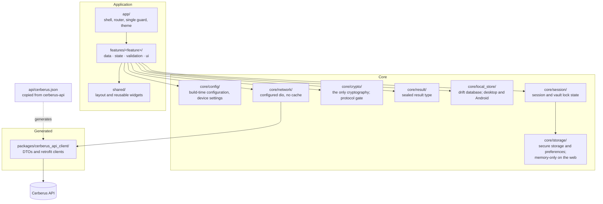

# Operations & Infrastructure Document — Cerberus UI

## 1. Introduction

### 1.1 Purpose

This document captures **cross-cutting platform concerns** for **Cerberus UI** that fall outside the
domain modeled in the [Vision Document](Vision%20Document.md),
[System Requirements Document](System%20Requirements%20Document.md) and
[Use Case Specification Document](Use%20Case%20Specification%20Document.md).

These are capabilities of the *platform* rather than the domain, documented here to keep the domain
documents focused while still tracking the work formally. The technologies and versions this
platform is built on are defined once in the
[Technology Stack Document](Technology%20Stack%20Document.md) and referenced from here.

Platform requirements carry their own identifier space, `IR-xx`, so they never collide with the
domain's `FR-<AREA>-xx`. Together they are the Definition of Done of the foundation issue.

### 1.2 Scope

- The technical foundation: repository layout, the application's internal structure, and the
  scaffolding every feature is built on.
- The cryptography module's boundary and the protocol gate.
- The local store and the per-target storage implementations.
- The code generation pipeline and its drift check.
- Configuration, logging, environments, CI, packaging and delivery.

---

## 2. Technical Foundation

### 2.1 Overview

Cerberus UI is a single Flutter application with **no server component of its own**. Structurally it
is one package plus one generated package: the application in `lib/`, and the generated API client
in `packages/cerberus_api_client/`.

The foundation is what every use case is built on and what none of them should have to establish:
the folder structure, the app shell and router with its single guard, the session and configuration
providers, the result type, the storage wrappers for each target, the local store schema and its
migrations, the `core/crypto` module boundary with its protocol gate, the configured HTTP client,
the localization setup, the test scaffolding with its leak recorder, and CI.

### 2.2 Solution Architecture



### 2.3 Repository Layout

```
cerberus-ui/
├── .github/workflows/
│   ├── ci.yml                       format, analyze, boundaries, test, gate + web bundle check
│   ├── check-generated.yml          regenerate the client, local store code and l10n; fail on drift
│   ├── branch-policy.yml            enforce the branching model on pull requests
│   └── build.yml                    per-target artifacts
├── api/
│   └── cerberus.json                the API's OpenAPI document, copied from cerberus-api
├── assets/fonts/                    Roboto, bundled so the web fetches no font (FR-PV-04)
├── drift_schemas/                   the local store's schema snapshot per version
├── packages/
│   └── cerberus_api_client/         generated: DTOs and retrofit clients
├── lib/
│   ├── app/                         shell, router, the single guard, theme
│   ├── core/
│   │   ├── config/                  build-time configuration and device settings
│   │   ├── crypto/                  the Cerberus protocol, the protocol gate
│   │   ├── local_store/             drift schema, migrations, outbox, cursor, lease
│   │   ├── logging/                 the debug-only, redacting log
│   │   ├── network/                 the configured dio instance and its interceptors
│   │   ├── result/                  the sealed result type every repository returns
│   │   ├── session/                 session state, vault lock state, auto-lock
│   │   └── storage/                 secure storage and preference wrappers per target
│   ├── features/<feature>/
│   │   ├── data/                    repository interface, online and offline implementations
│   │   ├── state/                   providers, notifiers
│   │   ├── validation/              form validators and template rules
│   │   └── ui/                      screens and feature-local widgets
│   ├── l10n/                        ARB files, en-US
│   ├── shared/                      layout and reusable widgets
│   └── main.dart
├── test/                            mirrors lib/ exactly; test/support, test/vectors, test/tool
├── integration_test/                complete journeys
├── tool/
│   ├── generate_api_client.dart     the client generation pipeline
│   ├── check_boundaries.dart        the import boundary rules (boundary_rules.dart)
│   ├── check_protocol_gate.dart     the gate's CI rule (protocol_gate_rules.dart)
│   └── check_web_bundle.sh          no service worker, third-party font or local store on the web
├── packaging/
│   ├── windows/                     installer definition and portable archive layout
│   └── linux/                       installer definition
├── docker/
│   └── nginx.conf                   the web image's server configuration
├── android/ · linux/ · windows/ · web/
├── Dockerfile
├── analysis_options.yaml
├── build.yaml                       drift's generation options
├── l10n.yaml
├── swagger_parser.yaml
├── pubspec.yaml · pubspec.lock
└── docs/
    ├── initial/
    └── requirements/
```

There is no `ios/` and no `macos/` folder, and their absence is deliberate rather than pending.

### 2.4 Code Generation Pipelines

**The API client.**

```bash
dart run tool/generate_api_client.dart
```

Runs `swagger_parser` over `api/cerberus.json`, then `build_runner` inside the generated package,
then `dart format` over the package so the drift check compares like with like.

`api/cerberus.json` is **copied from the Cerberus API repository**
(`docs/contracts/openapi.json`), where that project generates it. It is not authored here, and
replacing it is a deliberate act of taking a new API contract, done in the change that needs it.

**The local store.**

```bash
dart run build_runner build --delete-conflicting-outputs
```

Emits drift's typed tables and queries. Schema changes come with a migration and a migration test,
a schema snapshot in `drift_schemas/` (`dart run drift_dev make-migrations`), and regenerated
migration test helpers (`dart run drift_dev schema generate drift_schemas/local_store/
test/core/local_store/generated/`).

Both pipelines are deterministic, which is what makes the drift check meaningful.

### 2.5 The Protocol Gate

Every protocol-dependent flow checks one constant in `core/crypto`, which records the approved
protocol version. While it records none, those flows are unavailable and the interface says why. It
changes only in the pull request that adopts an approved protocol — the one that adds the reviewed
Cerberus vectors to `test/vectors/` and pins the cryptographic libraries in the Technology Stack
Document. A release build with the gate open and no vectors present fails CI.

### 2.6 Storage per Target

| Target | Secure storage | Preferences | Local store |
| --- | --- | --- | --- |
| Windows, Linux, Android | Platform secure storage | Platform preferences | drift, in the default mode only |
| Web | Memory-only implementation of the same interface | Memory-only implementation | Not compiled in |

The web implementations are selected by conditional import, so the web build contains no code that
could write to browser storage.

### 2.7 Platform Requirements

| ID | Requirement |
| --- | --- |
| IR-01 | The repository shall follow the layout of §2.3, with tests mirroring `lib/` exactly. |
| IR-02 | The application shall be organized by feature, each feature owning its data, state, validation and UI, and depending on `core` rather than on another feature. |
| IR-03 | The application shall expose one central route guard by session, vault lock state, device profile and storage mode, and every route shall pass it. |
| IR-04 | The application shall provide a single sealed result type that every repository returns. |
| IR-05 | The application shall provide a `core/crypto` module as the only place a cryptographic package is imported, with a protocol gate that keeps protocol-dependent flows unavailable until an approved protocol version is recorded. |
| IR-06 | CI shall fail a build whose protocol gate is open without the Cerberus interoperability vectors present and passing. |
| IR-07 | The application shall provide secure storage and preference wrappers, with memory-only implementations on the web, and the token shall be writable only through the secure one. |
| IR-08 | The application shall provide the drift local store with its schema, migrations and migration tests, on Windows, Linux and Android only, and the web build shall not contain it. |
| IR-09 | The application shall provide one configured HTTP client instance carrying the bearer-token interceptor, base address and timeouts, with no cache. |
| IR-10 | The application shall generate its API client from `api/cerberus.json` by a single command, and commit the result unmodified. |
| IR-11 | CI shall regenerate the API client and the local store code and fail on any difference from what is committed. |
| IR-12 | A boundary check shall fail the build when a cryptographic package is imported outside `core/crypto`, or a storage package outside `core/storage` and `core/local_store`. |
| IR-13 | The test scaffolding shall provide the leak recorder of the Testing Specification §6.4, recording request bodies, local store rows, preference and secure-storage writes and log lines. |
| IR-14 | Configuration shall be supplied at build time by `--dart-define`, with no secret compiled into the artifact. |
| IR-15 | The application shall emit no log from a release build, and no log at any time shall carry a credential, token, key, recovery secret, plaintext or envelope body. |
| IR-16 | The application shall include no analytics, telemetry, crash reporting or third-party component that observes use. |
| IR-17 | The Android runner shall set `FLAG_SECURE` through a platform channel the application controls. |
| IR-18 | The web build shall register no service worker and use no browser storage API. |
| IR-19 | CI shall run formatting, `flutter analyze`, the boundary check and `flutter test` on every pull request into, and every push to, `develop` and `main`, and fail on any of them. |
| IR-20 | CI shall enforce the branching model on every pull request into `develop` and `main`. |
| IR-21 | CI shall build every target — web, Windows, Linux and Android — and publish the artifacts. |
| IR-22 | The web image shall serve the built application as static files from a non-root server, with a deep-link fallback and a health probe, and carry no application secret. |

---

## 3. Configuration

Configuration reaches the application two ways: **what the build decides** and **what the user
decides on a device**.

| Concern | Mechanism | Notes |
| --- | --- | --- |
| API base address | `--dart-define CERBERUS_API_BASE_URL` | The default instance for this build. Absent, the application starts at the setup screen (UC-01). |
| Instance address override | Entered by the user (UC-01) | Stored in preferences on desktop and Android; memory only on the web. |
| Storage mode and device profile | Chosen per device (UC-37, UC-19) | Preferences on desktop and Android; the web is always online only. |
| Lease verification keys | Pinned per device from the API | Public keys; not secrets. |
| Theme, auto-lock, clipboard clearing | Preferences (UC-10) | Memory only on the web. |
| Session token | Platform secure storage; memory on the web | Never a `--dart-define`, never a preference. |

**No secret is ever compiled into an artifact.** A Flutter build is distributed to users, and
anything inside it — including every `--dart-define` value, which ends up in the web bundle — is
readable. The only compiled-in values are addresses.

---

## 4. Logging & Observability

| Concern | Approach |
| --- | --- |
| Log format | Dart's `developer.log`, structured, **debug builds only** |
| Destination | The developer console. Nothing is written to a file or transmitted. |
| Release builds | Emit no log at all |
| Never logged | Credentials, tokens, vault passwords, recovery secrets, keys, plaintext, envelope bodies, request or response bodies carrying any of these |
| Crash reporting | **None** |
| Analytics | **None** |

The cost is real — a crash on a user's device produces no report — and it is accepted: a vault
client with a diagnostic channel has a second place its secrets can go.

**Server-side observability is the API's.** The API's health and logs belong to its operator. This
application consumes only the public readiness probe, to check an instance before adopting it.

---

## 5. Environments

| Environment | Purpose | Differences |
| --- | --- | --- |
| **Local** | Development | Points at a locally running API. Debug build, logs enabled, hot reload; plain HTTP accepted. |
| **Homologation** | Verifying a release before production | Points at the homologation API. Release build. |
| **Production** | The published application | Points at the production API. |

**The only difference between environments is the API address and the build mode.** No feature is
enabled in one and not another, and no code path branches on environment.

The web deployment's hostname is not recorded here. It belongs to the deployment platform, as for
the sibling UIs.

---

## 6. Build & Delivery

### 6.1 Continuous integration

Four workflows, mirroring the sibling repositories:

| Workflow | Runs | Does |
| --- | --- | --- |
| `ci.yml` | Every pull request into, and push to, `develop` and `main` | Verifies formatting, `flutter analyze`, the boundary check, `flutter test` and the protocol gate, builds the web bundle and checks it, and fails on any of them. |
| `check-generated.yml` | Every pull request into, and push to, `develop` and `main` | Regenerates the API client, drift's code and schema test helpers and the localizations, and fails on any difference. |
| `branch-policy.yml` | Every pull request into `develop` and `main` | Enforces the branching model described in [CONTRIBUTING.md](../../CONTRIBUTING.md). |
| `build.yml` | On a `v*` tag, and on demand | Builds all four targets and publishes the artifacts. |

### 6.2 Packaging per target

| Target | Artifact | Contents |
| --- | --- | --- |
| **Web** | A Docker image | The static build served by an unprivileged web server, with a deep-link fallback and a health probe. No service worker, no secret. |
| **Windows** | An `.exe` installer **and** a portable `.zip` | The application. The local store is created in the user's application support directory at first unlock in the default mode. |
| **Linux** | An installer | The application. |
| **Android** | An `.apk` | The application. |

### 6.3 Web deployment

The web image runs on the **VPS under Docker**, behind **Traefik** as the reverse proxy and TLS
terminator, the same way as the sibling UIs. The container serves static files and holds no
configuration beyond the API address compiled into the build. The API is not part of this
deployment; the browser reaches it directly at the address the build names.

Routing, certificates and the deploy job belong to the deployment platform,
[yggdrasil](https://github.com/artur-rios/yggdrasil), where this application gets its catalog entry
as part of the foundation.

### 6.4 Release

A release is cut from `develop` as a `release/x.y.z` branch and merged into `main`, which is tagged
`vx.y.z`; the steps are in [CONTRIBUTING.md](../../CONTRIBUTING.md). The tag starts `build.yml`,
which produces the four artifacts. The application's version comes from `pubspec.yaml`, and the
Cerberus API contract it was generated from is recorded with it, so a build and the API it needs
are identifiable as a pair.

---

## 7. Traceability

| Platform capability | Requirements |
| --- | --- |
| Repository and application structure | IR-01, IR-02 |
| The foundation every feature builds on | IR-03, IR-04, IR-07, IR-08, IR-09 |
| Cryptography boundary and protocol gate | IR-05, IR-06, IR-12 |
| Code generation and drift control | IR-10, IR-11 |
| Leak testing | IR-13 |
| Configuration and secrets | IR-14 |
| Logging, privacy and device hygiene | IR-15, IR-16, IR-17, IR-18 |
| Continuous integration | IR-19, IR-20, IR-21 |
| Deployment | IR-22 |

| Related domain requirements | Realized together with |
| --- | --- |
| FR-CR-01, FR-CR-02, NFR-04, NFR-16 (one crypto module, gated) | IR-05, IR-06, IR-12 |
| FR-DA-01, FR-DA-02, FR-DA-03, NFR-15 (repositories, generated client) | IR-04, IR-10, IR-11 |
| FR-DA-09, NFR-05 (one guard) | IR-03 |
| FR-DA-12, FR-OF-16, FR-PS-04 (nothing cached or stored on the web) | IR-07, IR-09, IR-18 |
| FR-OF-01, FR-OF-02 (ciphertext-only local store) | IR-08, IR-13 |
| FR-PV-01, FR-PV-02, FR-PV-03 (nothing observes, nothing leaks) | IR-15, IR-16, IR-17 |
| NFR-01, NFR-02 (no plaintext anywhere) | IR-13 |
| FR-CF-01 (build-time configuration) | IR-14 |
