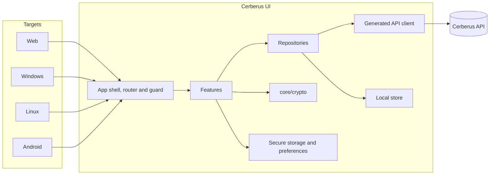
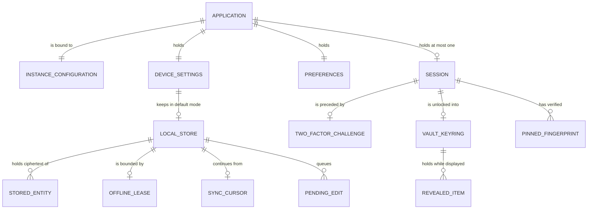
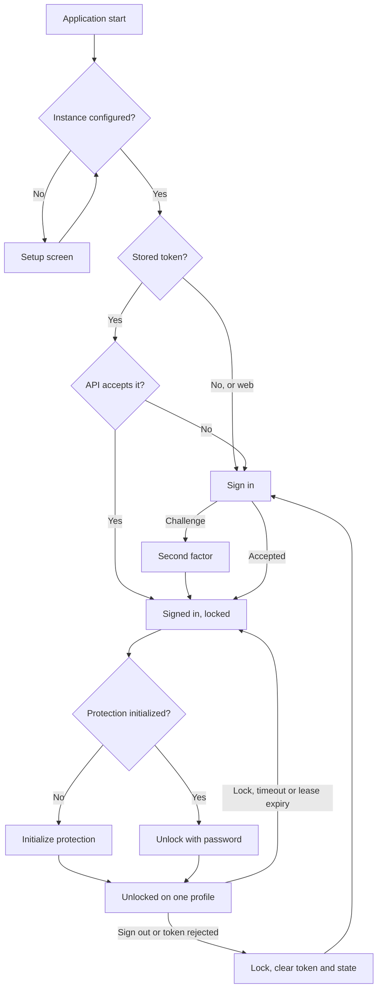

# System Requirements Document — Cerberus UI

## 1. Introduction

### 1.1 Purpose

This document specifies the functional and non-functional requirements for **Cerberus UI**.

The concrete technology stack is defined in the
[Technology Stack Document](Technology%20Stack%20Document.md). This document states requirements and
refers to that one for specific technologies and versions rather than restating them.

The vault's domain is specified by the [Cerberus API](https://github.com/artur-rios/cerberus-api)
and is not restated here either. Where a requirement below concerns a domain rule, it states what
the *client* must do about it — present it, respect it, or carry out the obligation the API hands
to its clients — never what the rule is. API requirements are cited as *API FR-xx*.

### 1.2 Scope

Cerberus UI covers: configuration and storage modes; session and identity; client-side
cryptography; vault access; profiles and devices; records; folders; collections; collection
sharing; software access; offline use and synchronization; the trash; the account lifecycle and
data rights; presentation and preferences; data access and routing; and privacy and device hygiene.
Each is one subsection of §3, and each owns one area code.

### 1.3 Definitions

Terms shared with the [Vision Document](Vision%20Document.md) are defined there and not repeated.

| Term | Definition |
| --- | --- |
| **Repository** | A feature-owned interface over the operations that feature needs. The seam every test substitutes at, and the place where online and offline paths meet. |
| **View state** | The state of a data-backed screen: `Locked`, `Loading`, `Loaded`, `Empty` or `Failed`. |
| **Guard** | The single central route redirect that admits or refuses a route by session, vault lock state, device profile and storage mode. |
| **Protocol gate** | The single switch that keeps every protocol-dependent flow unavailable until the Cerberus protocol has passed its review. |
| **Outbox** | The part of the local store that holds pending offline edits. |
| **Notice** | A message shown to the user, derived from an API answer, a sync outcome or a local check. Never invented. |
| **Fresh authentication** | Re-entering identity credentials (and any second factor) for the action at hand, as the API requires. |
| **Plaintext** | Any decrypted vault content, any vault password, the recovery secret, or any unwrapped key. |

---

## 2. System Overview

Two shapes matter. **Features depend on repositories, never on `dio` or the local store**, so the
online and offline paths are interchangeable below that line. And **only `core/crypto` touches a
cryptographic primitive**: features hand it plaintext and receive envelopes, and the reverse.

The local store exists only on Windows, Linux and Android in the default mode. The web build does
not contain it.

---

## 3. Functional Requirements

### 3.1 Configuration and Storage Modes — `CF`

| ID | Requirement |
| --- | --- |
| FR-CF-01 | The system shall read its API base address from a value supplied at build time. |
| FR-CF-02 | The system shall present a setup screen when no address is configured, and shall accept only a well-formed HTTPS URL, allowing plain HTTP in debug builds only. |
| FR-CF-03 | The system shall check the instance's public readiness endpoint before adopting an address, and shall report an unreachable or unready instance without adopting it. |
| FR-CF-04 | The system shall offer the default and online-only storage modes on Windows, Linux and Android, chosen per device. |
| FR-CF-05 | The system shall run the web application in online-only mode always, and shall offer no storage mode choice there. |
| FR-CF-06 | The system shall show the device's current storage mode in the application shell and in settings at all times. |
| FR-CF-07 | The system shall delete the local store when a device switches from the default mode to online only, after warning about any pending edits that would be lost. |
| FR-CF-08 | The system shall create the local store and perform an initial synchronization at the first unlock after a device switches to the default mode. |
| FR-CF-09 | The system shall keep the instance address and device settings in preference storage on desktop and Android, and in memory only on the web. |
| FR-CF-10 | The system shall confine platform-specific behavior to storage mode availability, secure storage backing, screen-capture protection, file saving and window chrome. |

### 3.2 Session and Identity — `SE`

| ID | Requirement |
| --- | --- |
| FR-SE-01 | The system shall register an account through the API with an email and a password, sending a stable idempotency key and reusing it when the same registration is retried. |
| FR-SE-02 | The system shall sign a user in through the API with an email and a password. |
| FR-SE-03 | The system shall present a second-factor challenge when the sign-in response carries one, and shall complete it through the API's challenge endpoint. |
| FR-SE-04 | The system shall grant no access while a second-factor challenge is outstanding, holding the signed-out state. |
| FR-SE-05 | The system shall answer a rejected sign-in with the API's message, without distinguishing causes the API made indistinguishable. |
| FR-SE-06 | The system shall store the session token in platform secure storage on desktop and Android, and in memory only on the web. |
| FR-SE-07 | The system shall retain no identity credential beyond the request that carries it, and shall clear credential fields when their screen is left. |
| FR-SE-08 | The system shall restore a stored session at start by verifying it with the API before showing any screen that depends on it, and shall discard it if the API rejects it. |
| FR-SE-09 | The system shall end the session, lock the vault and ask for sign-in when a token is rejected mid-session, without attempting a silent refresh. |
| FR-SE-10 | The system shall not automatically replay an action interrupted by an authentication failure. |
| FR-SE-11 | The system shall clear the token, lock the vault and discard all in-memory state on sign-out. |
| FR-SE-12 | The system shall, on sign-out in the default mode, offer to remove the vault from the device, and otherwise keep the ciphertext local store. |
| FR-SE-13 | The system shall display the Cerberus account details, decrypting the encrypted details only while the vault is unlocked. |
| FR-SE-14 | The system shall update the Cerberus account details, encrypting them on the device before sending. |
| FR-SE-15 | The system shall update the identity details held by Heimdall through the API, presented separately from vault profiles. |
| FR-SE-16 | The system shall perform fresh authentication before recovery, account closure, permanent account deletion and data export. |
| FR-SE-17 | The system shall reach identity only through the Cerberus API, and shall call no other identity service. |

### 3.3 Client-Side Cryptography — `CR`

| ID | Requirement |
| --- | --- |
| FR-CR-01 | The system shall perform every cryptographic operation in a single `core/crypto` module that implements only the reviewed Cerberus protocol. |
| FR-CR-02 | The system shall keep every flow that encrypts, decrypts, wraps, proves or recovers unavailable until the protocol gate records an approved protocol version. |
| FR-CR-03 | The system shall encrypt every content-bearing payload into the protocol's versioned envelope, binding owner, resource kind, resource identifier and key epoch as authenticated metadata. |
| FR-CR-04 | The system shall verify the authentication tag and the authenticated metadata of every envelope it decrypts, and shall report a failure as tampered content without displaying any of it. |
| FR-CR-05 | The system shall use a fresh random nonce for every encryption, never reuse a nonce under the same key, and rotate the key epoch before the protocol's per-key message bound. |
| FR-CR-06 | The system shall derive password keys with the protocol's reviewed parameters, off the UI isolate, showing progress while it runs. |
| FR-CR-07 | The system shall wrap keys for a recipient only with that recipient's public key, bound to its pinned fingerprint. |
| FR-CR-08 | The system shall prove vault access by signing a single-use API challenge with the client-held access key. |
| FR-CR-09 | The system shall verify every offline lease's signature against pinned server verification keys before relying on it. |
| FR-CR-10 | The system shall pass the RFC known-answer vectors for every primitive and the Cerberus interoperability vectors for every protocol construction. |
| FR-CR-11 | The system shall overwrite the key buffers it owns and drop every reference to keys and plaintext when the vault locks. |

### 3.4 Vault Access — `VA`

| ID | Requirement |
| --- | --- |
| FR-VA-01 | The system shall initialize vault protection on the device — master password or one password per profile — generating keys and a recovery secret locally and sending only wrapped keys, public keys and the recovery verifier. |
| FR-VA-02 | The system shall show the recovery secret once, require the user to confirm having saved it, and never store it. |
| FR-VA-03 | The system shall unlock the vault by deriving keys from the entered password on the device and opening profile access through the API with a signed challenge. |
| FR-VA-04 | The system shall, in per-profile mode, open the profile whose wrapper the entered password unlocks, trying only the device profile on a restricted device. |
| FR-VA-05 | The system shall report an incorrect vault password as such, determined on the device, without sending the password anywhere. |
| FR-VA-06 | The system shall, in the default mode while offline, unlock against the local protection bundle under a valid offline lease. |
| FR-VA-07 | The system shall lock the vault when the user asks. |
| FR-VA-08 | The system shall lock the vault after the configured inactivity timeout. |
| FR-VA-09 | The system shall lock the vault on sign-out, at session end and at offline lease expiry, discarding every key and decrypted item. |
| FR-VA-10 | The system shall change the master password, a profile password or the protection scheme by submitting the complete replacement wrapper set with the expected protection revision. |
| FR-VA-11 | The system shall present a refused or conflicting protection change without leaving any protection partially changed on the device. |
| FR-VA-12 | The system shall recover vault access with the recovery secret after fresh authentication, decrypting the recovery material on the device and submitting the recovery proof with replacement protection. |
| FR-VA-13 | The system shall, after a recovery, show the newly generated recovery secret once under the same rule as FR-VA-02. |
| FR-VA-14 | The system shall resolve a recovery whose response was lost by retrying with the same operation, never generating a second recovery. |
| FR-VA-15 | The system shall refresh the recovery key on request, showing the new secret once and stating that the previous one no longer works. |

### 3.5 Profiles and Devices — `PF`

| ID | Requirement |
| --- | --- |
| FR-PF-01 | The system shall create a profile with a name encrypted on the device. |
| FR-PF-02 | The system shall list the account's profiles with names decrypted in memory. |
| FR-PF-03 | The system shall display a profile with its records, folders and collections. |
| FR-PF-04 | The system shall rename a profile. |
| FR-PF-05 | The system shall delete a profile to the trash, stating that its records, folders and collections are kept. |
| FR-PF-06 | The system shall restrict a device to one profile, so that the device opens, stores and synchronizes only that profile, and shall lift the restriction only after fresh authentication. |
| FR-PF-07 | The system shall set a profile's contents: owned records, folders and collections, and shared collections the account can access. |
| FR-PF-08 | The system shall show only the open profile's permitted content, and shall require that profile's unlock to switch to another. |

### 3.6 Records — `RC`

| ID | Requirement |
| --- | --- |
| FR-RC-01 | The system shall create a record from scratch with a name and any number of user-defined fields. |
| FR-RC-02 | The system shall create a record from the password, login or note template, refusing to save it without the template's required fields. |
| FR-RC-03 | The system shall require a record name before encrypting the record. |
| FR-RC-04 | The system shall support text, numeric, boolean and hidden-text fields, accepting only a number in a numeric field. |
| FR-RC-05 | The system shall list the open profile's records with names decrypted in memory. |
| FR-RC-06 | The system shall search and sort records on the device over decrypted names and non-hidden fields, sending no search term to the API. |
| FR-RC-07 | The system shall decrypt a record when it is opened and discard the plaintext when it is closed. |
| FR-RC-08 | The system shall conceal hidden-text fields until the user reveals them, and conceal them again when the record is closed. |
| FR-RC-09 | The system shall copy a field value to the clipboard on request and clear it after the configured interval unless the clipboard has changed since. |
| FR-RC-10 | The system shall update a record with its expected revision, and on a conflict shall present the current version instead of overwriting it. |
| FR-RC-11 | The system shall move a record into a folder or out of any folder. |
| FR-RC-12 | The system shall delete a record to the trash, stating the 30-day restoration window. |
| FR-RC-13 | The system shall permanently delete a record immediately after a separate confirmation that states it is irreversible. |
| FR-RC-14 | The system shall mark shared records as shared, naming the owner, and shall offer editing only under a read/write grant. |

### 3.7 Folders — `FD`

| ID | Requirement |
| --- | --- |
| FR-FD-01 | The system shall create a folder at the top level or under a parent folder, with a name encrypted on the device. |
| FR-FD-02 | The system shall present folders as a tree with names decrypted in memory. |
| FR-FD-03 | The system shall rename a folder. |
| FR-FD-04 | The system shall move a folder under another parent or to the top level, offering neither the folder itself nor its descendants as a parent, and shall present the API's refusal of a cycle. |
| FR-FD-05 | The system shall delete a folder to the trash, stating that its nested folders and records are deleted with it. |

### 3.8 Collections — `CL`

| ID | Requirement |
| --- | --- |
| FR-CL-01 | The system shall create a collection with a name encrypted on the device. |
| FR-CL-02 | The system shall list owned and shared collections, marking shared ones with their owner and permission. |
| FR-CL-03 | The system shall display a collection's effective members, including the descendants of member folders. |
| FR-CL-04 | The system shall rename an owned collection. |
| FR-CL-05 | The system shall delete an owned collection to the trash, stating that its records and folders are kept and its shares are revoked. |
| FR-CL-06 | The system shall set an owned collection's member records and folders, offering this only to the owner. |

### 3.9 Collection Sharing — `SH`

| ID | Requirement |
| --- | --- |
| FR-SH-01 | The system shall share an owned collection with another account, read-only or read/write. |
| FR-SH-02 | The system shall display a recipient's key fingerprint and require the owner to confirm it was verified through an independent channel before the first share, pinning it. |
| FR-SH-03 | The system shall block sharing with a recipient whose key no longer matches the pinned fingerprint until it is verified again. |
| FR-SH-04 | The system shall wrap the collection's keys for the recipient on the device. |
| FR-SH-05 | The system shall change a recipient's permission between read-only and read/write. |
| FR-SH-06 | The system shall revoke a share, rotating the collection's key epoch so the revoked recipient is excluded from new keys, and stating that copies already made cannot be retracted. |
| FR-SH-07 | The system shall list, for a recipient, the collections shared with them, with owner and permission. |
| FR-SH-08 | The system shall offer a read-only recipient no edit, and a read/write recipient edits of existing records and folders only. |
| FR-SH-09 | The system shall let a recipient include an accessible shared collection in their own profiles. |
| FR-SH-10 | The system shall offer sharing administration only to the collection's owner. |

### 3.10 Software Access — `SW`

| ID | Requirement |
| --- | --- |
| FR-SW-01 | The system shall grant a Heimdall software identity read-only access to selected records or collections. |
| FR-SW-02 | The system shall wrap the granted keys for the software identity's public key on the device, under the fingerprint rules of FR-SH-02 and FR-SH-03. |
| FR-SW-03 | The system shall list the account's software grants with their targets. |
| FR-SW-04 | The system shall revoke a software grant, stating that copies already retrieved cannot be retracted. |

### 3.11 Offline Use and Synchronization — `OF`

| ID | Requirement |
| --- | --- |
| FR-OF-01 | The system shall, in the default mode, keep a local store holding only ciphertext envelopes, server-visible metadata, the protection bundle, the offline lease, the synchronization cursor and pending edits. |
| FR-OF-02 | The system shall write no plaintext and no unwrapped key to the local store. |
| FR-OF-03 | The system shall display the account's offline renewal policy and let the owner set an interval or disable renewal. |
| FR-OF-04 | The system shall warn, before renewal is disabled, that revocations reach a disconnected device only when it reconnects. |
| FR-OF-05 | The system shall renew the offline authorization whenever online, and before expiry, and verify the new lease before adopting it. |
| FR-OF-06 | The system shall lock the offline vault when an enabled-renewal lease expires, until online renewal succeeds. |
| FR-OF-07 | The system shall judge lease expiry against the latest time it has observed, never extending a lease because the device clock moved backwards. |
| FR-OF-08 | The system shall open and read the vault from the local store while offline under a valid lease. |
| FR-OF-09 | The system shall queue offline creations, edits and deletions as pending edits with a client UTC edit timestamp, a stable operation identifier and, for new items, a client-generated public identifier, and shall mark them pending. |
| FR-OF-10 | The system shall download changes from the stored cursor and apply visibility removals and deletion tombstones before displaying new content. |
| FR-OF-11 | The system shall replace the local store with a fresh authorized snapshot when the API reports the cursor invalid or expired. |
| FR-OF-12 | The system shall upload pending edits and present each one's outcome — applied, superseded, denied or permanently deleted — showing the winning version of a superseded edit and keeping the user's version available to apply again. |
| FR-OF-13 | The system shall remove the local copies and pending edits of permanently deleted items. |
| FR-OF-14 | The system shall retry an interrupted synchronization with the same operation identifiers, so that a repeated upload never applies twice. |
| FR-OF-15 | The system shall persist no vault data in online-only mode or on the web. |
| FR-OF-16 | The system shall use no browser storage, cache or service worker on the web, and shall end the session when the page reloads. |

### 3.12 Trash — `TR`

| ID | Requirement |
| --- | --- |
| FR-TR-01 | The system shall list the owner's trashed records, folders, collections and profiles with their expiry. |
| FR-TR-02 | The system shall restore a trash entry before its deadline, restoring a folder together with the contents its deletion removed and nothing deleted separately. |
| FR-TR-03 | The system shall present the associations the API could not revalidate when a collection or profile is restored. |
| FR-TR-04 | The system shall empty the trash after a confirmation that states it is irreversible. |
| FR-TR-05 | The system shall present an entry that expired while displayed as permanently deleted, not as a failure. |

### 3.13 Account Lifecycle and Data Rights — `AC`

| ID | Requirement |
| --- | --- |
| FR-AC-01 | The system shall request account closure after fresh authentication, stating that access is revoked immediately and can be restored by cancelling within 30 days, and shall sign out afterwards. |
| FR-AC-02 | The system shall cancel a pending closure through fresh sign-in before its deadline, stating that previous sessions and shares are not revived. |
| FR-AC-03 | The system shall delete the account permanently after a separate confirmation stating that it is irreversible, that shared content the account owns disappears for its recipients, and that the Heimdall identity survives. |
| FR-AC-04 | The system shall remove the local store from the device when the account is closed or deleted. |
| FR-AC-05 | The system shall request the account's data export from the API and save it through the platform's file saving. |
| FR-AC-06 | The system shall offer, only while unlocked, a decrypted export produced on the device, stating that the file will contain plaintext and requiring explicit confirmation. |

### 3.14 Presentation and Preferences — `PS`

| ID | Requirement |
| --- | --- |
| FR-PS-01 | The system shall offer light, dark and system theme modes. |
| FR-PS-02 | The system shall let the user set the auto-lock timeout, or choose never with a warning. |
| FR-PS-03 | The system shall let the user set the clipboard clearing interval, or choose never with a warning. |
| FR-PS-04 | The system shall persist preferences on desktop and Android, and hold them in memory only on the web. |
| FR-PS-05 | The system shall render every data-backed screen in one of five states — locked, loading, loaded, empty or failed — offering a retry from the failed state and never showing stale content as current. |

### 3.15 Data Access and Routing — `DA`

| ID | Requirement |
| --- | --- |
| FR-DA-01 | The system shall reach the API and the local store only through repository interfaces; no feature, provider or widget shall depend on `dio` or the local store directly. |
| FR-DA-02 | The system shall generate its API client from the API's OpenAPI document and never hand-edit the result. |
| FR-DA-03 | The system shall return a result value from every repository operation rather than throwing. |
| FR-DA-04 | The system shall attach the session token to every request that requires it, and never place it in a URL. |
| FR-DA-05 | The system shall send the idempotency keys and expected revisions the API contract requires. |
| FR-DA-06 | The system shall present the API's own reason for a refusal, without substituting, softening or generalizing it. |
| FR-DA-07 | The system shall treat client-side validation as feedback only, submitting and honoring the API's answer even where the client expected success. |
| FR-DA-08 | The system shall not report an online write as saved until the API confirms it. |
| FR-DA-09 | The system shall guard every route centrally by session, vault lock state, device profile and storage mode, including routes reached by typed URL, deep link or restored session. |
| FR-DA-10 | The system shall not rely on a hidden control as protection; nothing concealed shall become possible by manipulating client state. |
| FR-DA-11 | The system shall offer each action only to an actor permitted to take it. |
| FR-DA-12 | The system shall configure no HTTP cache and store no API response outside the local store. |

### 3.16 Privacy and Device Hygiene — `PV`

| ID | Requirement |
| --- | --- |
| FR-PV-01 | The system shall include no analytics, telemetry, crash reporting or third-party component that observes use. |
| FR-PV-02 | The system shall write no credential, token, key, recovery secret, plaintext or envelope body to any log, and shall emit no log from a release build. |
| FR-PV-03 | The system shall exclude its screens from screenshots and the recent-apps preview on Android. |
| FR-PV-04 | The system shall send data to no destination other than the configured Cerberus API. |

---

## 4. Data Model

### 4.0 Identifier Strategy

The application carries the API's public GUIDs opaquely: it never parses, orders or derives one. The
one case where it creates them is an entity created offline, for which it generates a random
version-4 GUID that the API then enforces as unique (API §4.0). Operation identifiers for
synchronization and idempotency keys for registration and recovery are generated the same way and
kept until their outcome is known.

### 4.1 Entity Relationship Diagram

### 4.2 Session Fields

| Field | Type | Constraints | Description |
| --- | --- | --- | --- |
| AccountId | GUID | Required | The Cerberus account's public identifier. |
| Token | string | Required; secure storage or memory only | Never in preferences, a URL or the local store. |
| State | enum | Required — signed out, challenge pending, signed in | A pending challenge grants nothing. |

### 4.3 DeviceSettings Fields

| Field | Type | Constraints | Description |
| --- | --- | --- | --- |
| StorageMode | enum | Required — default or online only; online only on the web | Chosen per device. |
| DeviceProfileId | GUID | Optional | The one profile this device opens, when restricted. |
| ServerVerificationKeys | list of public keys | Required in the default mode | Pinned keys that verify offline leases. Public by nature. |

### 4.4 Preferences Fields

| Field | Type | Constraints | Description |
| --- | --- | --- | --- |
| ThemeMode | enum | Required — light, dark or system | Defaults to system. |
| AutoLockTimeout | duration or never | Required | Defaults to 5 minutes. |
| ClipboardClearInterval | duration or never | Required | Defaults to 30 seconds. |

### 4.5 VaultKeyring Fields (memory only)

| Field | Type | Constraints | Description |
| --- | --- | --- | --- |
| ProfileId | GUID | Required | The open profile. |
| ContentKeys | key handles by epoch | Required | Never serialized. |
| AccessKey | private key handle | Required | Signs challenges. Never serialized. |
| UnlockedAt / LastActivityAt | timestamps | Required | Drive auto-lock. |

### 4.6 StoredEntity Fields (local store)

| Field | Type | Constraints | Description |
| --- | --- | --- | --- |
| PublicId | GUID | Required, unique | As the API assigned or as generated offline. |
| Kind | enum | Required — profile, folder, record, collection | |
| Envelope | encrypted envelope | Required | Exactly as the API holds it. Never plaintext. |
| Metadata | server-visible fields | Required | Parent folder, memberships, associations, revision, edit time, sequence. |
| Pending | bool | Required | Whether a local edit has not been uploaded yet. |

### 4.7 OfflineLease Fields (local store)

| Field | Type | Constraints | Description |
| --- | --- | --- | --- |
| Token | ES256 JWS | Required | Verified before use. |
| Scope | profile and grant identifiers | Required | What may be opened offline. |
| ExpiresAt | timestamp or none | None only when renewal is disabled | |
| LatestObservedTime | timestamp | Required | The clock-rollback guard. |

### 4.8 PendingEdit Fields (local store)

| Field | Type | Constraints | Description |
| --- | --- | --- | --- |
| OperationId | GUID | Required, unique | Makes the upload idempotent. |
| EntityPublicId | GUID | Required | Generated on the device for creations. |
| Kind | enum | Required — create, update, delete, move | |
| Envelope | encrypted envelope | Required for content changes | Never plaintext. |
| EditedAt | UTC timestamp | Required | The latest-edit comparison input. |

---

## 5. Screen Surface Overview

This application's interface surface is its screens. Each is reached by a route, and every route
passes the single central guard (`FR-DA-09`). "Unlocked" means a signed-in session with an open
vault keyring.

### 5.1 Configuration, identity and unlock

| Route | Screen | Access | Requirement |
| --- | --- | --- | --- |
| `/setup` | Instance address | Anonymous | FR-CF-02 |
| `/register` | Registration | Anonymous | FR-SE-01 |
| `/sign-in` | Sign-in | Anonymous | FR-SE-02 |
| `/sign-in/challenge` | Second-factor challenge | Challenge pending | FR-SE-03 |
| `/closure/cancel` | Cancel a pending closure | Freshly signed in, closure pending | FR-AC-02 |
| `/vault/setup` | Initialize vault protection | Signed in, protection not initialized | FR-VA-01 |
| `/unlock` | Unlock | Signed in, locked | FR-VA-03 |
| `/recover` | Recover vault access | Signed in, locked | FR-VA-12 |

### 5.2 The vault

| Route | Screen | Access | Requirement |
| --- | --- | --- | --- |
| `/` | Vault home: records and folders of the open profile, search | Unlocked | FR-RC-05 |
| `/records/new` | New record, blank or from a template | Unlocked | FR-RC-01 |
| `/records/:id` | Record detail, reveal and copy | Unlocked | FR-RC-07 |
| `/records/:id/edit` | Edit record | Unlocked, write permission | FR-RC-10 |
| `/folders/:id` | Folder contents | Unlocked | FR-FD-02 |
| `/collections`, `/collections/:id` | Collections, members and shares | Unlocked | FR-CL-02 |
| `/collections/:id/share` | Share a collection and verify the recipient | Unlocked, owner | FR-SH-01 |
| `/shared` | Collections shared with me | Unlocked | FR-SH-07 |
| `/profiles`, `/profiles/:id` | Profiles and their contents | Unlocked | FR-PF-02 |
| `/software-access` | Software grants | Unlocked | FR-SW-03 |
| `/trash` | Trash | Unlocked | FR-TR-01 |
| `/sync` | Synchronization status and outcomes | Unlocked, default mode | FR-OF-12 |

### 5.3 Settings

| Route | Screen | Access | Requirement |
| --- | --- | --- | --- |
| `/settings` | Theme, auto-lock, clipboard clearing | Signed in | FR-PS-01 |
| `/settings/device` | Storage mode and device profile | Signed in; mode choice not on the web | FR-CF-04 |
| `/settings/account` | Account and identity details | Signed in; details need unlock | FR-SE-13 |
| `/settings/security` | Change protection, refresh recovery key | Unlocked | FR-VA-10 |
| `/settings/offline` | Offline renewal policy | Unlocked | FR-OF-03 |
| `/settings/privacy` | Export, closure, permanent deletion | Unlocked | FR-AC-05 |

### 5.4 API dependencies

Every API endpoint a use case calls is listed in the use case. These capabilities the client needs
are **not yet in the API's specified contract**, and the use cases that need them are blocked until
they exist:

| Needed capability | Needed by | API reference |
| --- | --- | --- |
| Approval of the Cerberus protocol after security and interoperability review | Every protocol-dependent use case | API NFR-11, IR-09 |
| Challenge issuance for vault-access proofs (proposed `POST /api/vault/challenges`) | UC-13 | Protocol review, *Online access proof* |
| A recipient's public encryption key and its fingerprint, looked up by account | UC-32 | API FR-SH-01 (keys wrapped for the recipient) |
| A software identity's public encryption key | UC-35 | API FR-SW-02 |
| Listing a collection's grants | UC-30, UC-33 | API FR-SH-04 (grants are addressed by identifier) |
| Listing the account's software grants | UC-36 | API FR-SW-05 (grants are addressed by identifier) |
| Publication of the lease verification keys | UC-39 | Protocol review, *Offline lease binding and rotation* |
| A distinct report that an account is pending closure, at sign-in and when a session is restored | UC-46, and the offers in UC-03 AF-04 and UC-05 AF-06 | API UC-07 (FR-AC-02); today `POST /api/auth/login` answers `authentication_required` and `GET /api/vault/protection` (the session check of UC-05) answers `not_found` for a pending-closure account, exactly as for unknown credentials or an account without vault protection |
| A distinct report that a second-factor challenge has expired, been exhausted or been redeemed, apart from a refused code | UC-04 (AF-02) | API UC-02 AF-04; Heimdall reports it as `ChallengeTokenInvalid`, but `POST /api/auth/2fa/verify` answers `authentication_required` for both, because the API maps every Heimdall 401 and 404 to it |

---

## 6. Non-Functional Requirements

| ID | Category | Requirement |
| --- | --- | --- |
| NFR-01 | Security | The system shall send no plaintext and no unwrapped key to any destination, verified by tests that record every request body for every content-bearing flow. |
| NFR-02 | Security | The system shall write no plaintext and no unwrapped key to any storage, verified by tests that inspect the local store, preferences and secure storage. |
| NFR-03 | Security | The system shall use encrypted transport for every API call outside debug builds. |
| NFR-04 | Security | The system shall implement no cryptographic primitive by hand. |
| NFR-05 | Security | The system shall enforce access by a single central route guard rather than per screen. |
| NFR-06 | Privacy | The system shall include no analytics, telemetry or crash reporting. |
| NFR-07 | Privacy | The system shall satisfy the GDPR and the LGPD in the obligations that fall to a client: data export, account deletion, and no undisclosed data flow. |
| NFR-08 | Responsiveness | The system shall never block the UI isolate on key derivation, bulk decryption or synchronization. |
| NFR-09 | Reliability | The system shall present a failure as a failure with a retry, and never present stale data as current. |
| NFR-10 | Reliability | The system shall keep the local store consistent across an interrupted synchronization, committing each downloaded page and each upload outcome atomically. |
| NFR-11 | Portability | The system shall build and run on the web, Windows, Linux and Android from one source, with platform-specific code confined to what `FR-CF-10` names. |
| NFR-12 | Portability | The system shall render legibly in light and dark themes and at mobile, tablet and desktop widths. |
| NFR-13 | Accessibility | The system shall label every interactive element for assistive technology, announce a revealed hidden field, and convey no state by color alone. |
| NFR-14 | Localization | The system shall take every user-facing string from localization resources, with no hard-coded text, shipping `en-US` at the first release. |
| NFR-15 | Maintainability | The system shall keep generated code generated: the API client and the local store's generated code are never hand-edited, and CI fails on drift. |
| NFR-16 | Maintainability | The system shall confine cryptographic calls to `core/crypto` and storage calls to `core/storage` and `core/local_store`, enforced by an automated boundary check. |
| NFR-17 | Measurability | The system shall measure, not assume, unlock time, synchronization time and frame timing; no numerical target is set for the beta, matching the API's decision. |

---

## 7. Authorization Matrix

The API enforces authorization; this matrix states what the interface **offers**, which must match
it (`FR-DA-11`).

| Operation | Anonymous | Signed in, locked | Owner, unlocked | Read/write recipient | Read-only recipient |
| --- | --- | --- | --- | --- | --- |
| Configure the instance | ✅ | ✅ | ✅ | — | — |
| Register, sign in, complete a challenge | ✅ | ❌ | ❌ | — | — |
| View or update identity details | ❌ | ✅ | ✅ | — | — |
| View or update account details | ❌ | ❌ | ✅ | — | — |
| Unlock, recover | ❌ | ✅ | — | — | — |
| Change protection, refresh recovery | ❌ | ❌ | ✅ | — | — |
| Manage own profiles, records, folders, collections | ❌ | ❌ | ✅ | — | — |
| Read shared content | ❌ | ❌ | ✅ own | ✅ | ✅ |
| Edit shared records and folders | ❌ | ❌ | ✅ own | ✅ | ❌ |
| Delete shared content, change membership or parents | ❌ | ❌ | ✅ own | ❌ | ❌ |
| Share, change or revoke a share | ❌ | ❌ | ✅ own | ❌ | ❌ |
| Include a shared collection in own profiles | ❌ | ❌ | — | ✅ | ✅ |
| Grant or revoke software access | ❌ | ❌ | ✅ own | ❌ | ❌ |
| Set the offline policy, choose storage mode and device profile | ❌ | ⚠️ mode only | ✅ | — | — |
| Trash: list, restore, empty | ❌ | ❌ | ✅ own | ❌ | ❌ |
| Export, close or delete the account | ❌ | ❌ | ✅ with fresh authentication | — | — |
| Cancel a pending closure | ⚠️ after fresh sign-in | — | — | — | — |

**Legend:** ✅ offered · ⚠️ offered under the stated condition · ❌ not offered · — not applicable.

---

## 8. Lifecycle Strategy

Three lifecycles are the client's own: the session, the vault lock, and the offline lease. Deletion
mirrors the API's and is presented, never reimplemented.

**Offline lease.** In the default mode, unlocking offline requires a valid lease. With renewal
enabled, the lease's expiry — judged against the latest observed time — locks the vault until an
online renewal succeeds. With renewal disabled, there is no periodic expiry, and revocations take
effect at the next reconnection, which applies removals before anything else.

**Deletion, as the interface presents it.** Deleting a record, folder, collection or profile moves
it to the trash for 30 days, with the consequence stated: a folder takes its contents with it, a
collection or profile leaves them in place. Permanent deletion — a single record, or the whole
trash — is a separate, separately confirmed, irreversible act. An account's closure is reversible
for 30 days; its immediate permanent deletion is not, and is confirmed separately again.

---

## 9. Traceability

### 9.1 Area codes

| Domain area | Code | Requirements |
| --- | --- | --- |
| Configuration and storage modes | `CF` | FR-CF-01 … FR-CF-10 |
| Session and identity | `SE` | FR-SE-01 … FR-SE-17 |
| Client-side cryptography | `CR` | FR-CR-01 … FR-CR-11 |
| Vault access | `VA` | FR-VA-01 … FR-VA-15 |
| Profiles and devices | `PF` | FR-PF-01 … FR-PF-08 |
| Records | `RC` | FR-RC-01 … FR-RC-14 |
| Folders | `FD` | FR-FD-01 … FR-FD-05 |
| Collections | `CL` | FR-CL-01 … FR-CL-06 |
| Collection sharing | `SH` | FR-SH-01 … FR-SH-10 |
| Software access | `SW` | FR-SW-01 … FR-SW-04 |
| Offline use and synchronization | `OF` | FR-OF-01 … FR-OF-16 |
| Trash | `TR` | FR-TR-01 … FR-TR-05 |
| Account lifecycle and data rights | `AC` | FR-AC-01 … FR-AC-06 |
| Presentation and preferences | `PS` | FR-PS-01 … FR-PS-05 |
| Data access and routing | `DA` | FR-DA-01 … FR-DA-12 |
| Privacy and device hygiene | `PV` | FR-PV-01 … FR-PV-04 |

### 9.2 Feature to requirements

| Feature | Requirements |
| --- | --- |
| F-01 Instance configuration and storage modes | FR-CF-01 through FR-CF-10 |
| F-02 Session and identity | FR-SE-01 through FR-SE-17 |
| F-03 Client-side cryptography | FR-CR-01 through FR-CR-11 |
| F-04 Vault protection and recovery | FR-VA-01 through FR-VA-15 |
| F-05 Profiles and devices | FR-PF-01 through FR-PF-08 |
| F-06 Records | FR-RC-01 through FR-RC-14 |
| F-07 Folders | FR-FD-01 through FR-FD-05 |
| F-08 Collections | FR-CL-01 through FR-CL-06 |
| F-09 Collection sharing | FR-SH-01 through FR-SH-10 |
| F-10 Software access | FR-SW-01 through FR-SW-04 |
| F-11 Offline use and synchronization | FR-OF-01 through FR-OF-16 |
| F-12 Trash | FR-TR-01 through FR-TR-05 |
| F-13 Account lifecycle and data rights | FR-AC-01 through FR-AC-06 |
| F-14 Presentation and preferences | FR-PS-01 through FR-PS-05 |
| F-15 Privacy and device hygiene | FR-PV-01 through FR-PV-04 |

The `DA` area realizes no single feature: it is the layer every feature is built on, traced by
business rule below and exercised by the use cases that cross it.

### 9.3 Business rule to requirements

| Business Rule | Realized by |
| --- | --- |
| BR-01 The API is the authority | FR-DA-01, FR-DA-08, FR-TR-03, FR-RC-11 |
| BR-02 Validation is feedback | FR-DA-07, FR-FD-04 |
| BR-03 Nothing saved on optimism | FR-DA-08, FR-OF-09, FR-OF-12 |
| BR-04 The API's reason is shown | FR-DA-06, FR-SE-05 |
| BR-05 Plaintext never leaves the device | FR-CR-03, FR-VA-01, FR-SE-14, FR-PF-01, FR-FD-01, NFR-01 |
| BR-06 Only the reviewed protocol | FR-CR-01, FR-CR-02, FR-CR-10, NFR-04 |
| BR-07 Metadata is verified | FR-CR-04 |
| BR-08 Fresh nonces | FR-CR-05 |
| BR-09 Passwords and recovery secret stay | FR-VA-01, FR-VA-03, FR-VA-05, FR-VA-10, FR-VA-12 |
| BR-10 Recipient keys are verified | FR-CR-07, FR-SH-02, FR-SH-03, FR-SW-02 |
| BR-11 Sign-in never unlocks | FR-VA-03, FR-VA-04 |
| BR-12 Decrypted only while displayed | FR-RC-07, FR-RC-08, FR-SE-13 |
| BR-13 The vault locks | FR-VA-07, FR-VA-08, FR-VA-09, FR-CR-11 |
| BR-14 The clipboard is cleared | FR-RC-09, FR-PS-03 |
| BR-15 No screen capture | FR-PV-03 |
| BR-16 One profile at a time | FR-PF-08, FR-PF-07 |
| BR-17 Device restriction | FR-PF-06, FR-VA-04 |
| BR-18 The default mode keeps ciphertext only | FR-CF-04, FR-OF-01, FR-OF-02, NFR-02 |
| BR-19 Online only persists nothing | FR-CF-07, FR-OF-15 |
| BR-20 The web persists nothing | FR-CF-05, FR-CF-09, FR-OF-16, FR-PS-04, FR-DA-12 |
| BR-21 The mode is visible | FR-CF-06 |
| BR-22 Leases are verified and expire | FR-CR-09, FR-OF-05, FR-OF-06, FR-VA-06, FR-OF-03 |
| BR-23 No clock rollback | FR-OF-07 |
| BR-24 Revocation first | FR-OF-10, FR-OF-11 |
| BR-25 Offline outcomes are shown | FR-OF-12, FR-OF-14 |
| BR-26 No resurrection | FR-OF-13 |
| BR-27 Actions match the actor | FR-DA-11, FR-RC-14, FR-SH-08, FR-SH-10, FR-CL-06 |
| BR-28 Hiding is not protection | FR-DA-09, FR-DA-10, NFR-05 |
| BR-29 Honest revocation | FR-SH-06, FR-SW-04 |
| BR-30 Named, typed records and templates | FR-RC-01, FR-RC-02, FR-RC-03, FR-RC-04 |
| BR-31 Local search | FR-RC-06 |
| BR-32 Trash, then permanent deletion | FR-RC-12, FR-RC-13, FR-TR-04 |
| BR-33 Folder and container deletion are stated | FR-FD-05, FR-CL-05, FR-PF-05 |
| BR-34 Closure and deletion | FR-AC-01, FR-AC-02, FR-AC-03, FR-AC-04, FR-SE-16 |
| BR-35 Credentials are not retained | FR-SE-07 |
| BR-36 Token storage | FR-SE-06, FR-DA-04 |
| BR-37 Rejection ends the session | FR-SE-09, FR-SE-10, FR-SE-08 |
| BR-38 Sign-out clears everything | FR-SE-11, FR-SE-12 |
| BR-39 A challenge grants nothing | FR-SE-04 |
| BR-40 Recovery secret shown once | FR-VA-02, FR-VA-13, FR-VA-14, FR-VA-15 |
| BR-41 Nothing observes the user | FR-PV-01, FR-PV-04, FR-SE-17, FR-SE-15, NFR-06 |
| BR-42 No sensitive logs | FR-PV-02 |
| BR-43 Export and deletion are reachable | FR-AC-05, FR-AC-06, NFR-07 |

Use-case coverage of every requirement is enumerated in the
[Use Case Specification Document §3](Use%20Case%20Specification%20Document.md). Platform
requirements are in the [Operations & Infrastructure Document](Operations%20%26%20Infrastructure%20Document.md).
