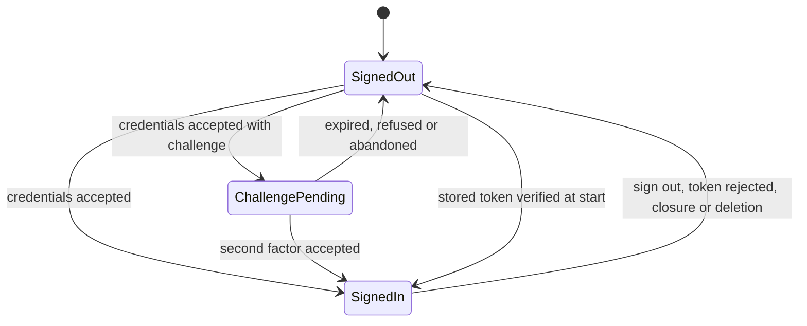
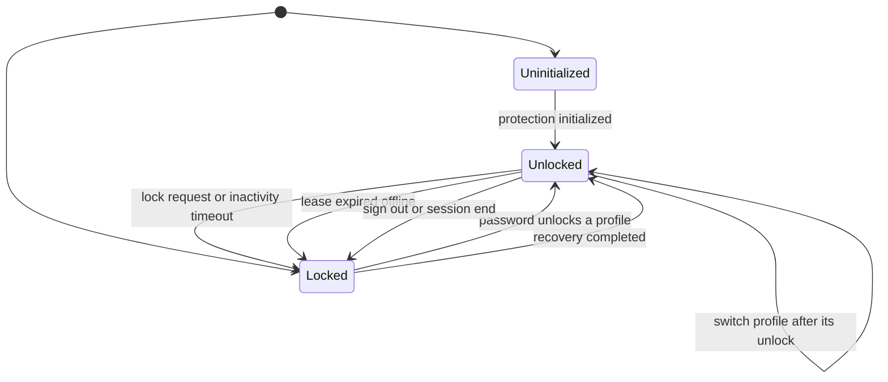
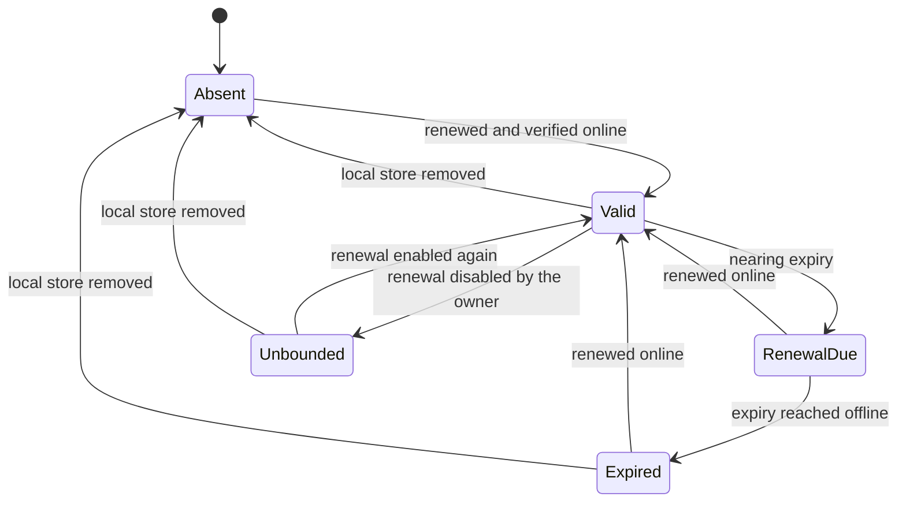
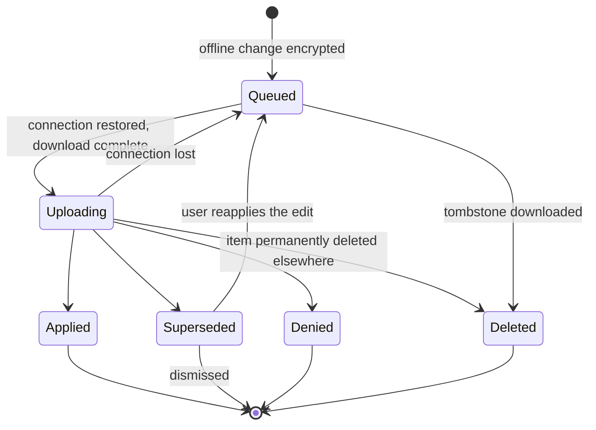

# Use Case Specification Document — Cerberus UI

## 1. Introduction

### 1.1 Purpose

This document specifies the use cases for **Cerberus UI**. Each one describes the actor
interactions, preconditions, postconditions, main flow, and alternative and exception flows for a
single user-visible capability or for one of the mechanisms every capability is built on.

Four conventions apply throughout, and they are what keep these use cases shorter than they would
otherwise be:

- **Every `{id}` is the API's public GUID**, carried opaquely. The client never parses, orders or
  derives one; it generates one only for an entity created offline
  ([System Requirements](System%20Requirements%20Document.md) §4.0).
- **Every refusal is the API's refusal**, presented with the API's reason (`FR-DA-06`). Where an
  alternative flow below says "the system presents the refusal", it means exactly that — not a
  message this application composed.
- **Any use case can lose its session.** A token rejected mid-flow ends the session, locks the vault
  and returns the user to sign-in without replaying the interrupted action (`FR-SE-09`,
  `FR-SE-10`). It is enumerated only where it interacts with the flow in a particular way.
- **Protocol-dependent use cases are unavailable until the protocol gate opens** (`FR-CR-02`). They
  are UC-08, UC-11 through UC-36, UC-39 through UC-43, and the decrypted export of UC-48 — every use
  case that encrypts, decrypts, wraps, proves or verifies a lease. Until the Cerberus protocol has
  passed its security and interoperability review, their entry points are absent and their routes
  refuse, rather than offering a flow that would fail or improvise cryptography. The remaining use
  cases depend only on their API endpoints existing.

Where a use case calls an API endpoint, the **API** row names it and the API use case it belongs
to, as specified in the
[Cerberus API System Requirements](https://github.com/artur-rios/cerberus-api/blob/develop/docs/requirements/System%20Requirements%20Document.md)
§5. Capabilities the API does not yet specify are listed in
[System Requirements §5.4](System%20Requirements%20Document.md) and named in the use cases that need
them.

### 1.2 Actors

| Actor | Description |
| --- | --- |
| **Account Owner** | The everyday user. Owns a vault and acts on it through this application, on any of the four targets. |
| **Read/write Recipient** | An account owner acting on a collection someone else shared with them read/write: reads and edits its existing records and folders. |
| **Read-only Recipient** | An account owner acting on a collection shared with them read-only: reads it and nothing more. |
| **Cerberus API** | The system this application consumes. The authority on ownership, grants, lifecycle and every server-visible fact; it never sees plaintext. |
| **Device platform** | The operating system or browser the application runs on: secure storage, the clipboard, lifecycle events, file saving and screen-capture protection. |

There is no administrator. Operating the API is outside this application.

### 1.3 Use Case Overview

```mermaid
graph LR
    subgraph Actors
        OWNER(("Account Owner"))
        RW(("Read/write Recipient"))
        RO(("Read-only Recipient"))
    end

    subgraph "Access and session"
        UC01["UC-01: Configure the instance"]
        UC02["UC-02: Register an account"]
        UC03["UC-03: Sign in"]
        UC04["UC-04: Second-factor challenge"]
        UC05["UC-05: Restore a session"]
        UC06["UC-06: Sign out"]
        UC07["UC-07: Guard a route"]
        UC09["UC-09: Update identity details"]
        UC10["UC-10: Choose preferences"]
    end

    subgraph "Vault protection"
        UC08["UC-08: Account details"]
        UC11["UC-11: Encrypt and decrypt"]
        UC12["UC-12: Initialize protection"]
        UC13["UC-13: Unlock the vault"]
        UC14["UC-14: Lock the vault"]
        UC15["UC-15: Change protection"]
        UC16["UC-16: Recover vault access"]
        UC17["UC-17: Refresh the recovery key"]
    end

    subgraph "Organized vault"
        UC18["UC-18: Manage profiles"]
        UC19["UC-19: Restrict a device"]
        UC20["UC-20: Profile contents"]
        UC21["UC-21: Create a record"]
        UC22["UC-22: Browse and search"]
        UC23["UC-23: Open and reveal"]
        UC24["UC-24: Edit a record"]
        UC25["UC-25: Move a record"]
        UC26["UC-26: Delete a record"]
        UC27["UC-27: Manage folders"]
        UC28["UC-28: Move a folder"]
        UC29["UC-29: Delete a folder"]
        UC30["UC-30: Manage collections"]
        UC31["UC-31: Collection members"]
    end

    subgraph "Sharing and software access"
        UC32["UC-32: Share a collection"]
        UC33["UC-33: Change or revoke a share"]
        UC34["UC-34: Use a shared collection"]
        UC35["UC-35: Grant software access"]
        UC36["UC-36: Revoke software access"]
    end

    subgraph "Offline use and synchronization"
        UC37["UC-37: Device storage mode"]
        UC38["UC-38: Offline policy"]
        UC39["UC-39: Renew offline authorization"]
        UC40["UC-40: Synchronize changes"]
        UC41["UC-41: Use the vault offline"]
        UC42["UC-42: Upload offline edits"]
    end

    subgraph "Recoverable deletion and data rights"
        UC43["UC-43: Browse and restore the trash"]
        UC44["UC-44: Empty the trash"]
        UC45["UC-45: Close the account"]
        UC46["UC-46: Cancel closure"]
        UC47["UC-47: Delete the account"]
        UC48["UC-48: Export account data"]
    end

    OWNER --> UC03
    OWNER --> UC13
    OWNER --> UC21
    OWNER --> UC23
    OWNER --> UC32
    OWNER --> UC41
    OWNER --> UC43
    OWNER --> UC48
    RW --> UC34
    RO --> UC34
```

---

## 2. Use Case Specifications

---

### UC-01: Configure the instance

| Field | Value |
| --- | --- |
| **ID** | UC-01 |
| **Name** | Configure the instance |
| **Actors** | Account Owner, Cerberus API |
| **Description** | Establish which Cerberus API instance this installation talks to, so that every later use case has one, and only one, destination. |
| **Preconditions** | The application has started. |
| **Postconditions** | A ready instance address is adopted — persisted on desktop and Android, held in memory on the web — and the sign-in screen is offered. |
| **Requirements** | FR-CF-01, FR-CF-02, FR-CF-03, FR-CF-09, FR-CF-10, FR-PV-01, FR-PV-04 |
| **API** | `GET /health/ready` (API UC-55, public readiness) |

**Main Flow**

1. The application starts and reads the API base address compiled in at build time.
2. Where no build-time address exists and none is stored, the system presents the setup screen.
3. The user enters the instance address.
4. The system checks that it is a well-formed HTTPS URL before attempting any request.
5. The system calls the instance's public readiness endpoint.
6. The instance reports ready; the system adopts the address, storing it in preferences on desktop
   and Android or holding it in memory on the web.
7. The system presents the sign-in screen. From here on, the adopted address is the only destination
   any request is sent to.

**Alternative Flows**

| ID | Condition | Outcome |
| --- | --- | --- |
| AF-01 | The address is not a well-formed URL, or uses plain HTTP in a release build | Rejected inline on the field; no request is attempted. |
| AF-02 | The instance cannot be reached | The setup screen reports the instance as unreachable and offers a retry; the address is not adopted. |
| AF-03 | The instance answers but reports itself not ready | The system reports that the instance is unavailable right now, names no internal dependency, and does not adopt the address. |
| AF-04 | A build-time address exists | Steps 2–4 are skipped; the readiness check still runs, and AF-02 or AF-03 present the setup screen pre-filled with that address. |
| AF-05 | The application runs on the web and the page is reloaded | The in-memory address is gone; the build-time address is used again, or the setup screen is shown. Nothing was written to the browser. |
| AF-06 | The user changes a stored address later, from the setup screen | The same checks apply; adopting a different instance signs the user out and, on desktop and Android, removes the local store, after confirmation, because it belongs to the previous instance. |

---

### UC-02: Register an account

| Field | Value |
| --- | --- |
| **ID** | UC-02 |
| **Name** | Register an account |
| **Actors** | Account Owner, Cerberus API |
| **Description** | Create a Cerberus account — and, through the API, its Heimdall identity — with an email and a password. |
| **Preconditions** | UC-01 has adopted an instance; the user is signed out. |
| **Postconditions** | An account exists and the user is directed to sign in; no credential is retained on the device. |
| **Requirements** | FR-SE-01, FR-SE-07, FR-SE-17, FR-DA-05, FR-DA-07 |
| **API** | `POST /api/accounts` (API UC-01) |

**Main Flow**

1. The user opens the registration screen and enters an email address and a password, the password
   twice.
2. The system checks the fields locally — email shape, password present and matching — as feedback
   only.
3. The system generates a stable idempotency key for this registration attempt.
4. The system submits the registration to the Cerberus API with the idempotency key. It calls no
   other identity service.
5. The API confirms the account.
6. The system clears the credential fields and discards the idempotency key.
7. The system presents the sign-in screen with the email pre-filled and a notice that the account
   was created.

**Alternative Flows**

| ID | Condition | Outcome |
| --- | --- | --- |
| AF-01 | A field fails the local check | Shown inline on that field; nothing is sent. |
| AF-02 | The local check passed but the API refuses the input | The API's reason is shown on the form; the client's check never overrides it. |
| AF-03 | The identity is already registered | The API's answer is presented, and the user is offered sign-in; the client never infers ownership from the email. |
| AF-04 | The request times out or the connection drops | The form keeps its fields and offers a retry that reuses the same idempotency key, so a completed upstream registration is resumed rather than duplicated. |
| AF-05 | The API reports identity as temporarily unavailable | The refusal is shown with a retry; nothing is assumed to have been created. |
| AF-06 | The user leaves the screen mid-registration | The fields are cleared and the idempotency key discarded; nothing is stored. |

---

### UC-03: Sign in

| Field | Value |
| --- | --- |
| **ID** | UC-03 |
| **Name** | Sign in |
| **Actors** | Account Owner, Cerberus API |
| **Description** | Establish an identity session with an email and a password. Signing in never unlocks the vault. |
| **Preconditions** | UC-01 has adopted an instance; the user is signed out. |
| **Postconditions** | A session exists, its token stored in secure storage on desktop and Android or in memory on the web; the vault is locked. |
| **Requirements** | FR-SE-02, FR-SE-05, FR-SE-06, FR-DA-01, FR-DA-02, FR-DA-03, FR-DA-04, FR-DA-06, FR-DA-12 |
| **API** | `POST /api/auth/login` (API UC-02) |

**Main Flow**

1. The user enters an email and a password on the sign-in screen.
2. The session feature calls its repository, which calls the generated API client; no feature
   touches `dio` directly.
3. The client submits the credentials over HTTPS with no HTTP cache in the path.
4. The repository returns a result value: a completed login, a pending challenge, or a refusal.
5. On a completed login, the system stores the token — secure storage on desktop and Android, memory
   on the web — and attaches it, as a header and never in a URL, to every later request.
6. The system clears the credential fields.
7. The system routes to the unlock screen, or to vault protection setup when the account has none
   (UC-12).

**Alternative Flows**

| ID | Condition | Outcome |
| --- | --- | --- |
| AF-01 | The API rejects the credentials | The API's generic message is shown; the client does not suggest whether the email exists. The password field is cleared. |
| AF-02 | The API answers with a second-factor challenge | No token is stored; the system continues with UC-04. |
| AF-03 | The instance is unreachable | A failure result is shown as a lost connection with a retry; no session is assumed. |
| AF-04 | The API refuses for another reason, such as an inactive account or a pending closure | The API's own reason is shown. The cancellation path of UC-46 is offered only once the API reports a pending closure distinctly at sign-in ([System Requirements](System%20Requirements%20Document.md) §5.4); until then a pending closure is refused like any other sign-in, and the client infers nothing from the refusal. |
| AF-05 | Secure storage is unavailable on a desktop or Android device | The system reports that the session cannot be kept and does not fall back to preferences or a file; the user may continue for this run with the token held in memory. |
| AF-06 | The response carries a field the generated client does not know | The unknown field is ignored; the generated client is never hand-edited to accommodate it. |

---

### UC-04: Complete a second-factor challenge

| Field | Value |
| --- | --- |
| **ID** | UC-04 |
| **Name** | Complete a second-factor challenge |
| **Actors** | Account Owner, Cerberus API |
| **Description** | Finish a sign-in that Heimdall accepted but challenged, by submitting the second factor through the Cerberus API. |
| **Preconditions** | UC-03 returned a pending challenge, held in memory only. |
| **Postconditions** | The challenge is completed into a session, or abandoned; until completion nothing is granted. |
| **Requirements** | FR-SE-03, FR-SE-04 |
| **API** | `POST /api/auth/2fa/verify` (API UC-02, AF-04) |

**Main Flow**

1. The system presents the challenge screen, naming the second-factor method the response asked for.
2. While the challenge is outstanding, every other route behaves as signed out.
3. The user enters the code.
4. The system submits the code with the challenge reference through the API's challenge endpoint.
5. The API completes the login.
6. The system discards the challenge, stores the token as in UC-03 step 5 and clears the code field.
7. The system routes to unlock or protection setup.

**Alternative Flows**

| ID | Condition | Outcome |
| --- | --- | --- |
| AF-01 | The code is refused | The API's message is shown and the code field cleared. The API does not yet tell a refused code apart from an expired or exhausted challenge ([System Requirements](System%20Requirements%20Document.md) §5.4), so the challenge stays outstanding for another attempt and the screen also offers to repeat the sign-in. |
| AF-02 | The challenge has expired | Once the API reports an expired challenge distinctly ([System Requirements](System%20Requirements%20Document.md) §5.4), the system discards it and returns to sign-in, stating that the sign-in must be repeated. Until then an expired challenge is refused like a wrong code (AF-01), and the offer to repeat the sign-in is how the user leaves it; the client infers nothing from the refusal. |
| AF-03 | The user navigates away or closes the application | The challenge is discarded; no partial session survives. |
| AF-04 | The connection is lost on submission | A retry is offered with the same challenge; no session is assumed. |
| AF-05 | A route is reached by typed URL while the challenge is outstanding | The guard (UC-07) treats it as signed out. |

---

### UC-05: Restore a session at start

| Field | Value |
| --- | --- |
| **ID** | UC-05 |
| **Name** | Restore a session at start |
| **Actors** | Account Owner, Cerberus API |
| **Description** | Resume a stored session on desktop and Android, verifying it before any screen that depends on it is shown. |
| **Preconditions** | The application starts on desktop or Android with an adopted instance. |
| **Postconditions** | A verified session with the vault locked, or a signed-out application with the stale token discarded. |
| **Requirements** | FR-SE-08 |
| **API** | `GET /api/vault/protection` (API UC-38) |

**Main Flow**

1. The application starts and finds a token in secure storage.
2. The system shows a neutral starting screen — no vault, no account detail.
3. The system requests the account's vault protection from the API with the token. It reads only the
   answer's outcome: the protection material in the answer is protocol material and is discarded
   unread.
4. The API accepts the token: it returns the protection, or reports that none was found.
5. The system marks the session signed in, with the vault locked, and records whether the account has
   vault protection — returned means it has; not found means it has none, or that the API holds no
   active account for it, which the API does not tell apart.
6. The system routes to the unlock screen when the account has protection, to vault protection setup
   (UC-12) when it has none, or to the route a deep link asked for, through the guard.

`GET /api/accounts/me` is not used to verify the session: it needs a vault-access handle, which only
an unlocked vault has, and answers `vault_access_required` for any session without one.

**Alternative Flows**

| ID | Condition | Outcome |
| --- | --- | --- |
| AF-01 | No token is stored | The system routes to sign-in. |
| AF-02 | The API rejects the token (`authentication_required`) | The token is deleted from secure storage and the user is sent to sign-in with a notice that the session ended. |
| AF-03 | The instance is unreachable, the device is in the default mode, and a valid offline lease exists | The system offers offline unlock (UC-13, UC-41) instead of failing; online-only features stay unavailable. |
| AF-04 | The instance is unreachable and no valid lease exists, or the device is online only | A lost connection is reported with a retry; no vault screen is shown. |
| AF-05 | The application runs on the web | There is never a stored token; the user signs in (UC-03). |
| AF-06 | The account is pending closure | The API's answer is shown. The cancellation path of UC-46 is offered only once the API reports a pending closure distinctly ([System Requirements](System%20Requirements%20Document.md) §5.4); until then the answer is handled like any other refusal of the stored session. |

---

### UC-06: Sign out

| Field | Value |
| --- | --- |
| **ID** | UC-06 |
| **Name** | Sign out |
| **Actors** | Account Owner |
| **Description** | End the session so that nothing readable about it survives on the device. |
| **Preconditions** | A session exists. |
| **Postconditions** | No token, no keys, no decrypted item and no in-memory state remain; in the default mode the ciphertext local store remains unless the user removed it. |
| **Requirements** | FR-SE-11, FR-SE-12 |
| **API** | None — client only. |

**Main Flow**

1. The user chooses to sign out.
2. In the default mode, the system asks whether to keep the vault on this device or remove it,
   stating that the kept copy is ciphertext only.
3. The system locks the vault (UC-14), discarding every key and decrypted item.
4. The system deletes the token from secure storage, or from memory on the web.
5. The system discards all in-memory state: lists, search results, view state and pending notices.
6. Where the user chose removal, the system deletes the local store.
7. The system presents the sign-in screen.

**Alternative Flows**

| ID | Condition | Outcome |
| --- | --- | --- |
| AF-01 | Pending offline edits exist and the user chose removal | The system states how many edits would be lost and asks again; declining keeps the store. |
| AF-02 | The device is online only or on the web | Step 2 is skipped; there is no local store. |
| AF-03 | Deleting the token from secure storage fails | The system reports it and still completes steps 3, 5 and 7; the token is overwritten on the next sign-in. |
| AF-04 | Sign-out is triggered by a rejected token (UC-07) rather than the user | Step 2 is skipped and the store is kept; the user is told the session ended. |

---

### UC-07: Guard a route

| Field | Value |
| --- | --- |
| **ID** | UC-07 |
| **Name** | Guard a route |
| **Actors** | Account Owner, Read/write Recipient, Read-only Recipient |
| **Description** | Admit or redirect every route centrally by session, vault lock state, device profile and storage mode, however it was reached. A mechanism rather than a screen. |
| **Preconditions** | The application is running. |
| **Postconditions** | The user sees only routes their current state admits, and only the actions their permission allows. |
| **Requirements** | FR-DA-09, FR-DA-10, FR-DA-11, FR-SE-09, FR-SE-10 |
| **API** | None — client only. |

**Main Flow**

1. A route is requested — by navigation, typed web URL, deep link or session restoration.
2. The single redirect evaluates the session: signed out, challenge pending or signed in.
3. It evaluates the vault: locked, unlocked on a profile, or protection not yet initialized.
4. It evaluates the device: storage mode, device profile and, offline, lease validity.
5. An admitted route renders; otherwise the redirect sends the user to sign-in, the challenge,
   protection setup or unlock, remembering the requested route.
6. The rendered screen offers only the actions the actor's permission allows on that content, as the
   API reported it.
7. After the user satisfies the redirect, the remembered route is opened through the guard again.

**Alternative Flows**

| ID | Condition | Outcome |
| --- | --- | --- |
| AF-01 | A token is rejected mid-session by any request | The session ends, the vault locks, and the user is sent to sign-in; the interrupted action is not replayed and is not queued. |
| AF-02 | A route for another profile's content is requested while a profile is open | The guard sends the user to unlock that profile; it never shows the content under the current one. |
| AF-03 | A route is requested on a device restricted to a profile, for content outside it | Refused with a not-available notice; the restriction is not lifted by navigation. |
| AF-04 | Client state is manipulated to show a hidden action and the action is attempted | The API's refusal is honored and shown; nothing hidden was relied on as protection. |
| AF-05 | A web URL names a route that does not exist | A not-found screen, passing through the same guard. |
| AF-06 | A protocol-dependent route is requested while the protocol gate is closed | A not-available screen explains that the feature waits for the protocol review. |

---

### UC-08: View and update account details

| Field | Value |
| --- | --- |
| **ID** | UC-08 |
| **Name** | View and update account details |
| **Actors** | Account Owner, Cerberus API |
| **Description** | Read and change the Cerberus account's own details, which are encrypted on the device and kept separate from identity details and vault profiles. |
| **Preconditions** | Signed in; the vault is unlocked to decrypt the details. |
| **Postconditions** | The details are displayed while the screen is open, and any change is stored as a new envelope. |
| **Requirements** | FR-SE-13, FR-SE-14 |
| **API** | `GET /api/accounts/me` (API UC-03), `PUT /api/accounts/me` (API UC-04) |

**Main Flow**

1. The user opens account settings.
2. The system requests the account from the API.
3. The system decrypts the details envelope through `core/crypto` and shows them, such as the display
   name.
4. The user edits a detail and saves.
5. The system encrypts the new details into an envelope bound to the account under the current key
   epoch.
6. The system submits the envelope with the expected revision.
7. The API confirms; the system shows the saved details and discards the plaintext when the screen
   closes.

**Alternative Flows**

| ID | Condition | Outcome |
| --- | --- | --- |
| AF-01 | The vault is locked | The identity part of the screen is shown; the encrypted details show a locked state with an unlock action. |
| AF-02 | The envelope fails verification | The details are shown as tampered and not displayed; editing is disabled. |
| AF-03 | The revision changed since loading | The API's conflict is shown with the current details decrypted; the user's edit is kept in the form to apply again. |
| AF-04 | The connection is lost on save | Nothing is shown as saved; a retry is offered. |
| AF-05 | The protocol gate is closed | The details section is absent; the screen still offers identity details (UC-09). |

---

### UC-09: Update identity details

| Field | Value |
| --- | --- |
| **ID** | UC-09 |
| **Name** | Update identity details |
| **Actors** | Account Owner, Cerberus API |
| **Description** | Change the identity details Heimdall holds, through the Cerberus API, presented apart from vault profiles. |
| **Preconditions** | Signed in. The vault may be locked. |
| **Postconditions** | Heimdall's identity details are updated through the API. |
| **Requirements** | FR-SE-15 |
| **API** | `PUT /api/identity/me` (API UC-05) |

**Main Flow**

1. The user opens account settings; identity details appear in their own section, labelled as the
   sign-in identity rather than a vault profile.
2. The user edits a detail and saves.
3. The system checks the field shape locally as feedback.
4. The system submits the change to the Cerberus API.
5. The API confirms.
6. The system shows the updated details.

**Alternative Flows**

| ID | Condition | Outcome |
| --- | --- | --- |
| AF-01 | The local check fails | Shown inline; nothing is sent. |
| AF-02 | The API refuses the change | The API's reason is shown on the field it concerns. |
| AF-03 | The API requires fresh authentication for the change | The system asks for the password (and any second factor) and resubmits once on success. |
| AF-04 | Identity is temporarily unavailable | The refusal is shown with a retry; the previous details remain displayed as current. |

---

### UC-10: Choose preferences

| Field | Value |
| --- | --- |
| **ID** | UC-10 |
| **Name** | Choose preferences |
| **Actors** | Account Owner |
| **Description** | Set the theme, the auto-lock timeout and the clipboard clearing interval. |
| **Preconditions** | Signed in. |
| **Postconditions** | The preferences apply immediately; they persist on desktop and Android and last for the visit on the web. |
| **Requirements** | FR-PS-01, FR-PS-02, FR-PS-03, FR-PS-04 |
| **API** | None — client only. |

**Main Flow**

1. The user opens settings.
2. The system shows the current theme mode, auto-lock timeout and clipboard clearing interval.
3. The user chooses light, dark or system theme; the application re-renders at once.
4. The user chooses an auto-lock timeout.
5. The user chooses a clipboard clearing interval.
6. The system stores the preferences in preference storage on desktop and Android, or holds them in
   memory on the web.

**Alternative Flows**

| ID | Condition | Outcome |
| --- | --- | --- |
| AF-01 | The user chooses "never" for auto-lock | A warning states that an unattended device would stay unlocked; the choice applies only after confirmation. |
| AF-02 | The user chooses "never" for clipboard clearing | A warning states that copied secrets would stay readable by other applications; the choice applies only after confirmation. |
| AF-03 | The application runs on the web | A notice states that preferences last only for this visit; the next visit starts from the defaults. |
| AF-04 | Preference storage cannot be written | The choice applies for this run and the system reports that it was not kept. |

---

### UC-11: Encrypt and decrypt vault content

| Field | Value |
| --- | --- |
| **ID** | UC-11 |
| **Name** | Encrypt and decrypt vault content |
| **Actors** | Device platform |
| **Description** | Turn plaintext into protocol envelopes and back, in one module, under the reviewed Cerberus protocol. A mechanism every content-bearing use case is built on. |
| **Preconditions** | The protocol gate records an approved protocol version; an unlocked keyring supplies the key. |
| **Postconditions** | The caller holds an envelope ready to send, or verified plaintext ready to display; nothing else was produced or logged. |
| **Requirements** | FR-CR-01, FR-CR-02, FR-CR-03, FR-CR-04, FR-CR-05, FR-CR-06, FR-CR-10, FR-PV-02 |
| **API** | None — client only. |

**Main Flow**

1. A feature hands `core/crypto` plaintext and the resource it belongs to: owner, resource kind,
   resource identifier.
2. `core/crypto` picks the current key epoch's key from the keyring.
3. It draws a fresh random nonce from the platform's secure generator and encrypts, binding owner,
   kind, identifier and epoch as authenticated metadata.
4. It returns the versioned envelope; the feature sends or stores only that.
5. For decryption, a feature hands `core/crypto` an envelope and the resource it is expected to be.
6. `core/crypto` verifies the tag and checks that the authenticated metadata names exactly that
   owner, kind, identifier and epoch.
7. It returns the plaintext for display. Key derivation, when a password is involved, runs off the
   UI isolate with progress shown.

**Alternative Flows**

| ID | Condition | Outcome |
| --- | --- | --- |
| AF-01 | The tag fails, or the metadata names another owner, resource or epoch | A tampered-content result; the item shows as tampered and none of it is displayed. |
| AF-02 | The envelope's format identifier is unknown | An unsupported-format result; the item is shown as unreadable by this version, never guessed at. |
| AF-03 | The current key is near the protocol's per-key message bound | `core/crypto` signals rotation; the caller rotates the epoch before encrypting more under it. |
| AF-04 | The protocol gate is closed | Every call returns a gate-closed result; callers' entry points are absent. |
| AF-05 | Any module outside `core/crypto` imports a cryptographic package | The boundary check fails the build. |
| AF-06 | A vector in the RFC or Cerberus interoperability suite fails | The suite fails and the build with it; no flow ships on a failing vector. |
| AF-07 | A debug log is written during encryption or decryption | It carries no key, plaintext or envelope body; release builds write none at all. |

---

### UC-12: Initialize vault protection

| Field | Value |
| --- | --- |
| **ID** | UC-12 |
| **Name** | Initialize vault protection |
| **Actors** | Account Owner, Cerberus API |
| **Description** | Set up the account's vault keys on the device — master password or one password per profile — and the one-time recovery secret. |
| **Preconditions** | Signed in; the account has no vault protection yet. |
| **Postconditions** | The API holds only wrapped keys, public keys and the recovery verifier; the user has confirmed saving the recovery secret; the vault is unlocked. |
| **Requirements** | FR-VA-01, FR-VA-02 |
| **API** | `POST /api/vault/protection` (API UC-38) |

**Main Flow**

1. The system presents protection setup and explains the choice between one master password and a
   password per profile.
2. The user chooses a scheme and enters the password twice (for per-profile, the first profile's).
3. The system derives the password key off the UI isolate and generates the vault keys, the access
   key pair and the recovery secret on the device.
4. The system wraps the keys and builds the recovery verifier and envelope.
5. The system submits only the wrapped keys, the public keys and the recovery verifier and envelope.
6. The API confirms.
7. The system shows the recovery secret once, with a warning that it cannot be shown again, and
   requires the user to confirm having saved it.
8. The system discards the secret and the password from memory and opens the vault.

**Alternative Flows**

| ID | Condition | Outcome |
| --- | --- | --- |
| AF-01 | The two password entries differ | Shown inline; nothing is derived. |
| AF-02 | The user tries to continue without confirming the secret was saved | Continuing stays disabled; the secret remains on screen. |
| AF-03 | The user leaves before confirming | A warning states that leaving discards the secret; protection is already initialized, so the user is directed to refresh the recovery key (UC-17) at the next unlock. |
| AF-04 | The API refuses the envelope set | The API's reason is shown and nothing is kept on the device. |
| AF-05 | Protection was initialized meanwhile from another device | The API's conflict is shown and the user is sent to unlock (UC-13). |
| AF-06 | The protocol gate is closed | The setup route shows that vault protection waits for the protocol review; no key is generated. |

---

### UC-13: Unlock the vault

| Field | Value |
| --- | --- |
| **ID** | UC-13 |
| **Name** | Unlock the vault |
| **Actors** | Account Owner, Cerberus API |
| **Description** | Open one profile by deriving its keys from a password on the device and proving vault access to the API. |
| **Preconditions** | Signed in, or offline in the default mode; protection initialized; the vault locked. |
| **Postconditions** | A keyring for one profile is in memory and an access session is open with the API; only that profile's content is shown. |
| **Requirements** | FR-VA-03, FR-VA-04, FR-VA-05, FR-VA-06, FR-CR-08, FR-PF-08 |
| **API** | `POST /api/profiles/{id}/access` (API UC-15), with challenge issuance — not yet specified by the API (System Requirements §5.4) |

**Main Flow**

1. The system presents the unlock screen: in master mode, a password field; in per-profile mode, a
   password field that opens whichever profile it unlocks; on a restricted device, only the device
   profile.
2. The user enters the password.
3. The system derives the key off the UI isolate, showing progress, and unwraps the protection
   bundle on the device.
4. In master mode, the system lists the profiles with decrypted names and the user picks one; in
   per-profile mode, the profile whose wrapper unlocked is chosen.
5. The system requests a single-use challenge and signs it with the access key.
6. The system opens profile access through the API with the signed challenge.
7. The API confirms; the system holds the keyring in memory and shows the vault home of that profile.

**Alternative Flows**

| ID | Condition | Outcome |
| --- | --- | --- |
| AF-01 | The password unlocks no wrapper | "Incorrect password", determined on the device; nothing was sent. |
| AF-02 | The device is offline in the default mode with a valid lease | Steps 5–6 are skipped; the profile opens from the local protection bundle within the lease scope (UC-41). |
| AF-03 | Offline with an expired lease while renewal is enabled | Unlock is refused with a statement that the device must reconnect to renew (UC-39). |
| AF-04 | The API refuses the proof — expired or replayed challenge, superseded protection | The API's reason is shown; the system requests a new challenge once, and on a superseded protection asks for the current password. |
| AF-05 | The challenge-issuance endpoint does not exist on the instance | The unlock screen states that this instance does not yet support vault access. |
| AF-06 | The user wants a different profile while one is open | The current keyring is locked first and this flow runs for the other profile. |
| AF-07 | The protocol gate is closed | The unlock route shows that vault access waits for the protocol review. |

---

### UC-14: Lock the vault

| Field | Value |
| --- | --- |
| **ID** | UC-14 |
| **Name** | Lock the vault |
| **Actors** | Account Owner, Device platform |
| **Description** | Discard every key and decrypted item from memory, on request, on inactivity, or when the session or lease ends. |
| **Preconditions** | The vault is unlocked. |
| **Postconditions** | No key and no plaintext remains reachable in memory; screens show the locked state. |
| **Requirements** | FR-VA-07, FR-VA-08, FR-VA-09, FR-CR-11 |
| **API** | None — client only. |

**Main Flow**

1. A lock is triggered: the user chooses lock, the auto-lock timeout elapses with no interaction,
   the user signs out, the session ends, or the offline lease expires.
2. The system closes every open record, discarding its revealed content.
3. The system overwrites the key buffers it owns and drops every reference to keys and plaintext.
4. The system clears in-memory decrypted lists and search results.
5. The system clears the clipboard if it still holds a value this application copied.
6. Every vault screen switches to the locked state, and the guard routes to unlock.

**Alternative Flows**

| ID | Condition | Outcome |
| --- | --- | --- |
| AF-01 | The user is editing a record when the timeout elapses | The edit is discarded and a notice after unlock states that an unsaved edit was lost; nothing plaintext was written anywhere to keep it. |
| AF-02 | The application is backgrounded and returns after the timeout | It returns locked; the inactivity clock counted while backgrounded. |
| AF-03 | Auto-lock is set to "never" | Only the other triggers lock the vault. |
| AF-04 | The lease expires while unlocked offline | The vault locks with a statement that it must reconnect to renew (UC-39). |
| AF-05 | The clipboard holds something another application put there | It is left untouched. |

---

### UC-15: Change vault protection

| Field | Value |
| --- | --- |
| **ID** | UC-15 |
| **Name** | Change vault protection |
| **Actors** | Account Owner, Cerberus API |
| **Description** | Change the master password, a profile password, or the protection scheme, re-wrapping keys on the device. |
| **Preconditions** | The vault is unlocked; the device is online. |
| **Postconditions** | The API holds the complete replacement wrapper set under a new protection revision, or nothing changed. |
| **Requirements** | FR-VA-10, FR-VA-11 |
| **API** | `PUT /api/vault/protection` (API UC-39) |

**Main Flow**

1. The user opens security settings and chooses what to change.
2. The system asks for the current password, and the new one twice.
3. The system verifies the current password on the device.
4. The system derives the new key off the UI isolate and re-wraps every affected key, including
   every profile wrapper a scheme change touches.
5. The system submits the complete replacement set with the expected protection revision.
6. The API confirms the new revision.
7. The system replaces its in-memory protection bundle, updates the local store in the default mode,
   and confirms the change.

**Alternative Flows**

| ID | Condition | Outcome |
| --- | --- | --- |
| AF-01 | The current password is wrong | Shown inline; nothing is derived or sent. |
| AF-02 | The new entries differ | Shown inline. |
| AF-03 | The protection revision changed meanwhile | The API's conflict is shown; the device keeps its previous bundle and asks the user to unlock again to load the current one. |
| AF-04 | The API refuses the set as incomplete | The refusal is shown; nothing on the device changed, and the change can be retried as a whole. |
| AF-05 | The device is offline | The action is unavailable, with the reason. |
| AF-06 | Other devices hold the old bundle in their local store | The confirmation states that other devices will need the new password after they synchronize. |

---

### UC-16: Recover vault access

| Field | Value |
| --- | --- |
| **ID** | UC-16 |
| **Name** | Recover vault access |
| **Actors** | Account Owner, Cerberus API |
| **Description** | Regain the vault with the one-time recovery secret when the password is lost, setting new protection and a new recovery secret. |
| **Preconditions** | Signed in with the vault locked; online. |
| **Postconditions** | The old recovery credential is consumed, new protection and a new recovery secret exist, the new secret was shown once, and the vault is unlocked. |
| **Requirements** | FR-VA-12, FR-VA-13, FR-VA-14, FR-SE-16 |
| **API** | `GET /api/vault/recovery-material`, `POST /api/vault/recovery` (API UC-40) |

**Main Flow**

1. From the unlock screen, the user chooses to recover.
2. The system performs fresh authentication: the identity password and any second factor.
3. The system fetches the encrypted recovery material.
4. The user enters the recovery secret; the system decrypts the material on the device.
5. The user sets a new password twice; the system derives it and builds replacement protection and a
   new recovery secret, verifier and envelope.
6. The system submits the recovery proof and the replacement set with a stable operation identifier.
7. The API commits; the system shows the new recovery secret once and requires confirmation that it
   was saved.
8. The system discards both secrets and the password and opens the vault.

**Alternative Flows**

| ID | Condition | Outcome |
| --- | --- | --- |
| AF-01 | The recovery secret does not decrypt the material | "Incorrect recovery key", determined on the device; nothing is sent. |
| AF-02 | The recovery credential was already consumed or superseded | The API's refusal is shown; the user is told the key no longer works. |
| AF-03 | The response is lost after submission | The system retries with the same operation identifier; the API reports the committed outcome and no second recovery happens. |
| AF-04 | Fresh authentication fails | The API's message is shown; recovery does not start. |
| AF-05 | The user leaves before confirming the new secret | A warning states it will not be shown again and that UC-17 can replace it; the recovery itself stands. |
| AF-06 | The protocol gate is closed | The recovery entry point is absent from the unlock screen. |

---

### UC-17: Refresh the recovery key

| Field | Value |
| --- | --- |
| **ID** | UC-17 |
| **Name** | Refresh the recovery key |
| **Actors** | Account Owner, Cerberus API |
| **Description** | Replace the recovery secret at any time, invalidating the previous one. |
| **Preconditions** | The vault is unlocked; online. |
| **Postconditions** | A new recovery credential is current, the previous one is superseded, and the new secret was shown once. |
| **Requirements** | FR-VA-15 |
| **API** | `PUT /api/vault/recovery` (API UC-41) |

**Main Flow**

1. The user opens security settings and chooses to refresh the recovery key.
2. The system states that the current recovery key will stop working.
3. The user confirms.
4. The system generates a new recovery secret, verifier and envelope on the device.
5. The system submits them with the expected protection revision.
6. The API confirms.
7. The system shows the new secret once, requires confirmation it was saved, then discards it.

**Alternative Flows**

| ID | Condition | Outcome |
| --- | --- | --- |
| AF-01 | The protection revision changed meanwhile | The API's conflict is shown; the user unlocks again and retries. |
| AF-02 | The connection is lost on submission | Nothing is shown as refreshed; the old key is presented as still current until a retry succeeds. |
| AF-03 | The user leaves before confirming | A warning states the secret will not be shown again; the refresh stands and can be repeated. |
| AF-04 | The device is offline | The action is unavailable, with the reason. |

---

### UC-18: Manage profiles

| Field | Value |
| --- | --- |
| **ID** | UC-18 |
| **Name** | Manage profiles |
| **Actors** | Account Owner, Cerberus API |
| **Description** | Create, list, view, rename and delete the account's profiles. |
| **Preconditions** | The vault is unlocked; online. |
| **Postconditions** | The profile set reflects the change as the API confirmed it; a deleted profile is in the trash with its contents kept. |
| **Requirements** | FR-PF-01, FR-PF-02, FR-PF-03, FR-PF-04, FR-PF-05 |
| **API** | `POST /api/profiles` (API UC-09), `GET /api/profiles` (API UC-10), `GET /api/profiles/{id}` (API UC-11), `PUT /api/profiles/{id}` (API UC-12), `DELETE /api/profiles/{id}` (API UC-13) |

**Main Flow**

1. The user opens profiles; the system lists them with names decrypted in memory.
2. The user creates a profile and enters its name; in per-profile mode, also its password, twice.
3. The system encrypts the name, builds the profile's key wrapper where needed, and submits it.
4. The API confirms; the new profile appears in the list.
5. The user opens a profile; the system shows its records, folders and collections.
6. The user renames it; the system encrypts the new name and submits it with the expected revision.
7. The user deletes a profile; the system states that its records, folders and collections are
   kept, and on confirmation submits the deletion and shows it in the trash.

**Alternative Flows**

| ID | Condition | Outcome |
| --- | --- | --- |
| AF-01 | The name is empty | Shown inline; nothing is encrypted. |
| AF-02 | A profile's name envelope fails verification | That profile is listed as tampered, with no name, and cannot be opened. |
| AF-03 | The profile changed meanwhile on rename | The API's conflict is shown with the current name; the user's edit is kept to apply again. |
| AF-04 | The user deletes the profile that is currently open | The confirmation states that the vault will lock; on confirmation it locks after the deletion. |
| AF-05 | The user deletes a device's restricted profile | The confirmation states that devices restricted to it will open nothing until their restriction is changed. |
| AF-06 | The device is offline | Creation, rename and deletion are unavailable with the reason in online-only use; in the default mode they are queued (UC-41). |

---

### UC-19: Restrict a device to a profile

| Field | Value |
| --- | --- |
| **ID** | UC-19 |
| **Name** | Restrict a device to a profile |
| **Actors** | Account Owner |
| **Description** | Make this device open, store and synchronize only one profile, and lift that restriction only after fresh authentication. |
| **Preconditions** | The vault is unlocked on the profile to restrict to. |
| **Postconditions** | The device settings name the device profile; in the default mode the local store holds only that profile's content. |
| **Requirements** | FR-PF-06 |
| **API** | None directly. The restriction is carried by the scope of later access sessions and offline authorizations (API UC-15, UC-47). |

**Main Flow**

1. The user opens device settings and chooses to restrict this device to the open profile.
2. The system states that the device will offer no other profile, and in the default mode that
   other profiles' content will be removed from the device.
3. The user confirms.
4. The system records the device profile in device settings.
5. In the default mode, the system removes other profiles' ciphertext from the local store and
   renews the offline authorization with the narrowed scope (UC-39).
6. The unlock screen now offers only the device profile.

**Alternative Flows**

| ID | Condition | Outcome |
| --- | --- | --- |
| AF-01 | The user lifts the restriction | Fresh authentication is required; then the device settings clear the device profile and, in the default mode, the next synchronization downloads the other profiles. |
| AF-02 | Pending edits exist for other profiles | The system states they would be lost and asks again; declining keeps the device unrestricted. |
| AF-03 | The device is offline in the default mode | The restriction applies locally at once; the narrowed authorization is requested at reconnection. |
| AF-04 | The device profile is deleted elsewhere | At the next synchronization the device reports that its profile no longer exists and offers to lift the restriction after fresh authentication. |
| AF-05 | The application runs on the web | The restriction lasts for the visit, like every web setting, and is stated as such. |

---

### UC-20: Set a profile's contents

| Field | Value |
| --- | --- |
| **ID** | UC-20 |
| **Name** | Set a profile's contents |
| **Actors** | Account Owner, Cerberus API |
| **Description** | Choose which owned records, folders and collections, and which accessible shared collections, a profile shows. |
| **Preconditions** | The vault is unlocked; online. |
| **Postconditions** | The profile's associations are replaced as the API confirmed. |
| **Requirements** | FR-PF-07 |
| **API** | `PUT /api/profiles/{id}/associations` (API UC-14) |

**Main Flow**

1. The user opens a profile and chooses to edit its contents.
2. The system lists owned records, folders and collections, and the shared collections the account
   can access, with names decrypted in memory and the current selection checked.
3. The user changes the selection.
4. The system submits the complete association set with the expected revision.
5. The API confirms.
6. The system shows the profile's new contents.

**Alternative Flows**

| ID | Condition | Outcome |
| --- | --- | --- |
| AF-01 | A selected shared collection's grant was revoked meanwhile | The API's refusal names it; the system removes it from the selection and offers to save the rest. |
| AF-02 | The associations changed meanwhile | The API's conflict is shown and the current selection reloaded; the user's choices are kept to reapply. |
| AF-03 | The user removes items from the profile that is open | The items disappear from the vault home on confirmation; they are not deleted. |
| AF-04 | The device is offline | The action is unavailable with the reason. |

---

### UC-21: Create a record

| Field | Value |
| --- | --- |
| **ID** | UC-21 |
| **Name** | Create a record |
| **Actors** | Account Owner, Cerberus API |
| **Description** | Store a new record — from scratch or from the password, login or note template — with a name and typed fields, encrypted on the device. |
| **Preconditions** | The vault is unlocked. |
| **Postconditions** | The API holds the record's envelope, or in the default mode offline the record is pending in the outbox. |
| **Requirements** | FR-RC-01, FR-RC-02, FR-RC-03, FR-RC-04 |
| **API** | `POST /api/records` (API UC-16) |

**Main Flow**

1. The user chooses to create a record, blank or from a template.
2. The system presents the form: a name, and the template's fields marked required where they are.
3. The user enters the name, fills fields, and adds custom fields, choosing for each a label and a
   type — text, numeric, boolean or hidden text.
4. The user optionally chooses a folder.
5. The user saves; the system checks that the name is present, required template fields are filled
   and numeric fields hold numbers.
6. The system encrypts the record into an envelope bound to the account and the new record's
   identifier.
7. The system submits the envelope and the folder.
8. The API confirms; the record appears in the vault home and the form's plaintext is discarded.

**Alternative Flows**

| ID | Condition | Outcome |
| --- | --- | --- |
| AF-01 | The name is empty | Shown inline; nothing is encrypted. |
| AF-02 | A template's required field is empty | Shown inline on that field; saving stays disabled. |
| AF-03 | A numeric field holds something else | Shown inline on that field. |
| AF-04 | The device is offline in the default mode | The record gets a client-generated identifier, is encrypted, and is queued as pending (UC-41), marked "saved on this device, pending synchronization". |
| AF-05 | The device is offline in online-only mode or on the web | Saving is refused with the reason; the form keeps its content until the user leaves. |
| AF-06 | The API refuses the envelope | The API's reason is shown and the form keeps its content. |
| AF-07 | The user leaves with unsaved content | The system asks to discard; on confirmation the plaintext is dropped. |

---

### UC-22: Browse and search the vault

| Field | Value |
| --- | --- |
| **ID** | UC-22 |
| **Name** | Browse and search the vault |
| **Actors** | Account Owner, Cerberus API |
| **Description** | See the open profile's records, folders and collections, and find records by searching and sorting on the device. |
| **Preconditions** | The vault is unlocked. |
| **Postconditions** | The list shows the profile's permitted content with names decrypted in memory; no search term left the device. |
| **Requirements** | FR-RC-05, FR-RC-06, FR-PS-05 |
| **API** | `GET /api/records` (API UC-17), `GET /api/folders` (API UC-24), `GET /api/collections` (API UC-30) |

**Main Flow**

1. The user opens the vault home; the system shows the loading state.
2. The system pages through the profile's records, folders and collections from the API, or from the
   local store in the default mode.
3. The system decrypts names in memory and shows the folder tree and the record list.
4. The user types a search term; the system filters on the device over decrypted names and non-hidden
   fields.
5. The user sorts by name or by last edit; the system sorts on the device.
6. The user opens a record (UC-23) or a folder.

**Alternative Flows**

| ID | Condition | Outcome |
| --- | --- | --- |
| AF-01 | The profile has no content | The empty state, with an action to create a record. |
| AF-02 | The search matches nothing | An empty result that reads as "no matches", distinct from an empty vault. |
| AF-03 | Loading fails | The failed state with a retry; no stale list is shown as current. |
| AF-04 | Some envelopes fail verification | Those items are listed as tampered with no name; the rest display normally. |
| AF-05 | The vault locks while the list is open | The locked state replaces the list and its decrypted names are discarded. |
| AF-06 | A refresh is running | The previous list stays visible marked as refreshing, never presented as the new result. |

---

### UC-23: Open a record and reveal its fields

| Field | Value |
| --- | --- |
| **ID** | UC-23 |
| **Name** | Open a record and reveal its fields |
| **Actors** | Account Owner, Device platform, Cerberus API |
| **Description** | Decrypt one record for display, reveal hidden fields on request, copy values, and discard the plaintext when the record closes. |
| **Preconditions** | The vault is unlocked. |
| **Postconditions** | The record was shown; on close, no plaintext of it remains in memory and the clipboard clears on schedule. |
| **Requirements** | FR-RC-07, FR-RC-08, FR-RC-09, FR-PV-03 |
| **API** | `GET /api/records/{id}` (API UC-18) |

**Main Flow**

1. The user opens a record.
2. The system fetches its envelope, or reads it from the local store, and decrypts it in memory.
3. The system shows the name and fields; hidden-text fields appear concealed.
4. The user reveals a hidden field; the system shows its value and announces the change to assistive
   technology.
5. The user copies a field; the system places the value on the clipboard and starts the clearing
   interval.
6. When the interval elapses and the clipboard still holds that value, the system clears it.
7. The user closes the record; the system conceals every field and discards the plaintext.

**Alternative Flows**

| ID | Condition | Outcome |
| --- | --- | --- |
| AF-01 | The envelope fails verification | The record is shown as tampered; no field is displayed or copyable. |
| AF-02 | The record was deleted or access removed since the list loaded | The API's not-found is shown and the record leaves the list. |
| AF-03 | The clipboard changed before the interval elapsed | It is left untouched. |
| AF-04 | Clipboard clearing is set to "never" | The value stays; the copy notice repeats the warning. |
| AF-05 | The user takes a screenshot or opens recent apps on Android | The platform shows a blank preview and refuses the capture. |
| AF-06 | The vault locks while the record is open | The record closes as in step 7. |
| AF-07 | The record is shared | It is marked as shared with its owner named (UC-34). |

---

### UC-24: Edit a record

| Field | Value |
| --- | --- |
| **ID** | UC-24 |
| **Name** | Edit a record |
| **Actors** | Account Owner, Read/write Recipient, Cerberus API |
| **Description** | Change a record's name and fields, re-encrypting it on the device and saving it only when the API confirms. |
| **Preconditions** | The vault is unlocked; the actor has write permission on the record. |
| **Postconditions** | The API holds the new envelope at a new revision, or in the default mode offline the edit is pending. |
| **Requirements** | FR-RC-10, FR-DA-08 |
| **API** | `PUT /api/records/{id}` (API UC-19) |

**Main Flow**

1. From an open record, the user chooses edit.
2. The system presents the decrypted fields in a form, hidden fields concealed until revealed.
3. The user changes the name, values, types or labels, or adds or removes fields.
4. The user saves; the system applies the same checks as UC-21.
5. The system encrypts the record into a new envelope and submits it with the expected revision.
6. The system shows the record as saving until the API confirms.
7. The API confirms; the system shows the saved record and discards the form's plaintext.

**Alternative Flows**

| ID | Condition | Outcome |
| --- | --- | --- |
| AF-01 | The record changed meanwhile | The API's conflict is shown with the current version decrypted beside the user's edit; the user chooses which to keep and saves again. |
| AF-02 | A required template field is emptied | Shown inline; saving stays disabled. |
| AF-03 | The connection drops before confirmation | The record is not shown as saved; the form keeps the edit and offers a retry. |
| AF-04 | The device is offline in the default mode | The edit is queued as pending with its edit time (UC-41). |
| AF-05 | The actor's write permission was revoked meanwhile | The API's refusal is shown and the form becomes read-only. |
| AF-06 | The user cancels | The system asks to discard changes; the plaintext is dropped. |

---

### UC-25: Move a record

| Field | Value |
| --- | --- |
| **ID** | UC-25 |
| **Name** | Move a record |
| **Actors** | Account Owner, Cerberus API |
| **Description** | Place a record in a folder, or take it out of any folder. |
| **Preconditions** | The vault is unlocked; the user owns the record. |
| **Postconditions** | The record's folder is changed as the API confirmed. |
| **Requirements** | FR-RC-11 |
| **API** | `PUT /api/records/{id}/folder` (API UC-21) |

**Main Flow**

1. The user chooses to move a record, from its detail or by dragging it in the list.
2. The system shows the folder tree with decrypted names, plus "no folder".
3. The user picks a destination.
4. The system submits the move with the expected revision.
5. The API confirms; the record appears in its new place.

**Alternative Flows**

| ID | Condition | Outcome |
| --- | --- | --- |
| AF-01 | The destination folder was deleted meanwhile | The API's refusal is shown and the tree reloaded. |
| AF-02 | The record changed meanwhile | The API's conflict is shown; the user retries against the current version. |
| AF-03 | The record belongs to someone else | The move action is not offered. |
| AF-04 | The device is offline in the default mode | The move is queued as pending (UC-41). |

---

### UC-26: Delete a record

| Field | Value |
| --- | --- |
| **ID** | UC-26 |
| **Name** | Delete a record |
| **Actors** | Account Owner, Cerberus API |
| **Description** | Move a record to the trash, or delete it permanently at once after a separate confirmation. |
| **Preconditions** | The vault is unlocked; the user owns the record. |
| **Postconditions** | The record is in the trash for 30 days, or permanently deleted. |
| **Requirements** | FR-RC-12, FR-RC-13 |
| **API** | `DELETE /api/records/{id}` (API UC-20), `DELETE /api/records/{id}/permanent` (API UC-22) |

**Main Flow**

1. The user chooses delete on a record.
2. The system states that the record goes to the trash and can be restored for 30 days.
3. The user confirms; the system submits the deletion.
4. The API confirms; the record leaves the vault and appears in the trash.
5. Alternatively, the user chooses "delete permanently".
6. The system presents a separate confirmation stating that this cannot be undone.
7. The user confirms; the system submits the permanent deletion and the record is gone.

**Alternative Flows**

| ID | Condition | Outcome |
| --- | --- | --- |
| AF-01 | The user cancels either confirmation | Nothing is sent. |
| AF-02 | The record changed or was deleted meanwhile | The API's answer is shown and the list reloaded. |
| AF-03 | The device is offline in the default mode | A trash deletion is queued as pending; permanent deletion is unavailable offline, with the reason. |
| AF-04 | The record is shared through a collection | The confirmation states that recipients lose it too. |
| AF-05 | The record belongs to someone else | Neither action is offered. |

---

### UC-27: Manage folders

| Field | Value |
| --- | --- |
| **ID** | UC-27 |
| **Name** | Manage folders |
| **Actors** | Account Owner, Cerberus API |
| **Description** | Create folders at the top level or inside others, see them as a tree, and rename them. |
| **Preconditions** | The vault is unlocked. |
| **Postconditions** | The folder tree reflects the change as the API confirmed. |
| **Requirements** | FR-FD-01, FR-FD-02, FR-FD-03 |
| **API** | `POST /api/folders` (API UC-23), `GET /api/folders` (API UC-24), `GET /api/folders/{id}` (API UC-25), `PUT /api/folders/{id}` (API UC-26) |

**Main Flow**

1. The system shows the folder tree with names decrypted in memory.
2. The user creates a folder at the top level or inside a selected one, entering its name.
3. The system encrypts the name and submits it with the parent.
4. The API confirms; the folder appears in the tree.
5. The user opens a folder and sees its subfolders and records.
6. The user renames it; the system encrypts the new name and submits it with the expected revision.

**Alternative Flows**

| ID | Condition | Outcome |
| --- | --- | --- |
| AF-01 | The name is empty | Shown inline; nothing is encrypted. |
| AF-02 | The parent was deleted meanwhile | The API's refusal is shown and the tree reloaded. |
| AF-03 | The folder changed meanwhile on rename | The API's conflict is shown with the current name. |
| AF-04 | A folder's name envelope fails verification | It is shown as tampered, without a name; its contents remain reachable. |
| AF-05 | The device is offline in the default mode | Creation and rename are queued as pending (UC-41). |

---

### UC-28: Move a folder

| Field | Value |
| --- | --- |
| **ID** | UC-28 |
| **Name** | Move a folder |
| **Actors** | Account Owner, Cerberus API |
| **Description** | Place a folder under another parent or at the top level, never inside itself or its descendants. |
| **Preconditions** | The vault is unlocked; the user owns the folder. |
| **Postconditions** | The folder's parent is changed as the API confirmed. |
| **Requirements** | FR-FD-04 |
| **API** | `PUT /api/folders/{id}/parent` (API UC-28) |

**Main Flow**

1. The user chooses to move a folder.
2. The system shows the tree with the folder itself and its descendants disabled, plus "top level".
3. The user picks a destination.
4. The system submits the new parent with the expected revision.
5. The API confirms; the tree shows the folder in its new place with its contents.

**Alternative Flows**

| ID | Condition | Outcome |
| --- | --- | --- |
| AF-01 | The tree changed elsewhere so that the move now forms a cycle | The API's refusal is shown and the tree reloaded; the client's check never overrides it. |
| AF-02 | The destination was deleted meanwhile | The API's refusal is shown. |
| AF-03 | The folder changed meanwhile | The API's conflict is shown; the user retries. |
| AF-04 | The device is offline in the default mode | The move is queued as pending; a cycle refused at upload is reported as a denied outcome (UC-42). |

---

### UC-29: Delete a folder

| Field | Value |
| --- | --- |
| **ID** | UC-29 |
| **Name** | Delete a folder |
| **Actors** | Account Owner, Cerberus API |
| **Description** | Move a folder to the trash together with its nested folders and records. |
| **Preconditions** | The vault is unlocked; the user owns the folder. |
| **Postconditions** | The folder and its contents are in the trash for 30 days. |
| **Requirements** | FR-FD-05 |
| **API** | `DELETE /api/folders/{id}` (API UC-27) |

**Main Flow**

1. The user chooses delete on a folder.
2. The system states that its nested folders and records are deleted with it, counting them, and
   that everything can be restored together for 30 days.
3. The user confirms.
4. The system submits the deletion.
5. The API confirms; the folder and its contents leave the vault and appear in the trash as one
   entry.

**Alternative Flows**

| ID | Condition | Outcome |
| --- | --- | --- |
| AF-01 | The user cancels | Nothing is sent. |
| AF-02 | A contained record also appears in collections or other profiles | The confirmation states that it is deleted everywhere it appears. |
| AF-03 | The folder changed meanwhile | The API's answer is shown and the tree reloaded. |
| AF-04 | The device is offline in the default mode | The deletion is queued as pending; contents are hidden locally until the outcome arrives. |

---

### UC-30: Manage collections

| Field | Value |
| --- | --- |
| **ID** | UC-30 |
| **Name** | Manage collections |
| **Actors** | Account Owner, Cerberus API |
| **Description** | Create, list, view, rename and delete collections, seeing owned and shared ones apart. |
| **Preconditions** | The vault is unlocked; online for changes. |
| **Postconditions** | The collection set reflects the change as the API confirmed; a deleted collection is in the trash with its contents kept and its shares revoked. |
| **Requirements** | FR-CL-01, FR-CL-02, FR-CL-03, FR-CL-04, FR-CL-05 |
| **API** | `POST /api/collections` (API UC-29), `GET /api/collections` (API UC-30), `GET /api/collections/{id}` (API UC-31), `PUT /api/collections/{id}` (API UC-32), `DELETE /api/collections/{id}` (API UC-33); listing a collection's shares needs a capability not yet specified (System Requirements §5.4) |

**Main Flow**

1. The user opens collections; the system lists owned and shared collections, marking shared ones
   with owner and permission.
2. The user creates a collection; the system encrypts its name and submits it.
3. The API confirms; the collection appears.
4. The user opens a collection; the system shows its effective members, including the descendants of
   member folders.
5. The user renames an owned collection; the system encrypts and submits it with the expected
   revision.
6. The user deletes an owned collection; the system states that its records and folders are kept and
   its shares revoked, and on confirmation submits the deletion.

**Alternative Flows**

| ID | Condition | Outcome |
| --- | --- | --- |
| AF-01 | The name is empty | Shown inline. |
| AF-02 | The collection is shared with the user rather than owned | Rename and delete are not offered. |
| AF-03 | The collection changed meanwhile | The API's conflict is shown with the current name. |
| AF-04 | The collection has active shares when deleted | The confirmation names how many recipients lose access, and states that restoring it will not revive the shares. |
| AF-05 | The instance cannot list shares | The collection's share section states that share listing is not available on this instance. |
| AF-06 | No collections exist | The empty state, with an action to create one. |

---

### UC-31: Set a collection's members

| Field | Value |
| --- | --- |
| **ID** | UC-31 |
| **Name** | Set a collection's members |
| **Actors** | Account Owner, Cerberus API |
| **Description** | Choose which records and folders an owned collection includes. |
| **Preconditions** | The vault is unlocked; online; the user owns the collection. |
| **Postconditions** | The membership is replaced as the API confirmed. |
| **Requirements** | FR-CL-06 |
| **API** | `PUT /api/collections/{id}/members` (API UC-34) |

**Main Flow**

1. The user opens an owned collection and chooses to edit its members.
2. The system shows owned records and folders with decrypted names, current members checked.
3. The user changes the selection; selecting a folder indicates that its descendants are included.
4. The system submits the complete member set with the expected revision.
5. The API confirms; the collection shows its new effective members.

**Alternative Flows**

| ID | Condition | Outcome |
| --- | --- | --- |
| AF-01 | The collection is shared | The editor states that recipients will see the change, including folder descendants. |
| AF-02 | The membership changed meanwhile | The API's conflict is shown and the selection reloaded; the user's choices are kept to reapply. |
| AF-03 | A selected item was deleted meanwhile | The API's refusal names it; the system removes it and offers to save the rest. |
| AF-04 | The collection is someone else's | The edit action is not offered. |

---

### UC-32: Share a collection

| Field | Value |
| --- | --- |
| **ID** | UC-32 |
| **Name** | Share a collection |
| **Actors** | Account Owner, Cerberus API |
| **Description** | Grant another account read-only or read/write access to an owned collection, after verifying the recipient's key fingerprint, wrapping the collection's keys for them on the device. |
| **Preconditions** | The vault is unlocked; online; the user owns the collection. |
| **Postconditions** | An active grant exists with keys wrapped for the verified recipient; the recipient's fingerprint is pinned. |
| **Requirements** | FR-SH-01, FR-SH-02, FR-SH-03, FR-SH-04, FR-SH-10, FR-CR-07 |
| **API** | `POST /api/collections/{id}/grants` (API UC-35); looking up the recipient's public key needs a capability not yet specified (System Requirements §5.4) |

**Main Flow**

1. From an owned collection, the user chooses share and identifies the recipient account.
2. The system obtains the recipient's public key and computes its fingerprint.
3. For a first share, the system shows the fingerprint and asks the user to compare it with the
   recipient through an independent channel, such as in person or a call.
4. The user confirms the fingerprint matches; the system pins it.
5. The user chooses read-only or read/write.
6. The system wraps the collection's keys for the recipient's key, bound to the pinned fingerprint.
7. The system submits the grant with the wrapped keys.
8. The API confirms; the share appears in the collection's share list.

**Alternative Flows**

| ID | Condition | Outcome |
| --- | --- | --- |
| AF-01 | The user does not confirm the fingerprint | Nothing is pinned and nothing is shared. |
| AF-02 | The recipient's key no longer matches the pinned fingerprint | Sharing is blocked with a warning that the key changed; it proceeds only after the new fingerprint is verified again. |
| AF-03 | The recipient account does not exist or cannot receive shares | The API's answer is shown. |
| AF-04 | The recipient already has a grant | The API's answer is shown and the user is offered to change it instead (UC-33). |
| AF-05 | The instance cannot provide recipient keys | The share action states that sharing is not available on this instance. |
| AF-06 | The collection is someone else's | The share action is not offered. |

---

### UC-33: Change or revoke a collection share

| Field | Value |
| --- | --- |
| **ID** | UC-33 |
| **Name** | Change or revoke a collection share |
| **Actors** | Account Owner, Cerberus API |
| **Description** | Switch a recipient between read-only and read/write, or revoke their access and rotate the collection's keys without them. |
| **Preconditions** | The vault is unlocked; online; the user owns the collection and it has a share. |
| **Postconditions** | The grant's permission is changed, or the grant is revoked and new keys exclude the recipient. |
| **Requirements** | FR-SH-05, FR-SH-06 |
| **API** | `PUT /api/collections/{id}/grants/{grantId}` (API UC-36), `DELETE /api/collections/{id}/grants/{grantId}` (API UC-37), key rotation through `PUT /api/vault/protection` (API UC-39); listing grants needs a capability not yet specified (System Requirements §5.4) |

**Main Flow**

1. The user opens a collection's shares and selects a recipient.
2. To change permission, the user picks the other level; the system submits it and the API confirms.
3. To revoke, the system states that the recipient loses access from their next request and on
   their devices' next reconnection, and that anything they already copied cannot be retracted.
4. The user confirms; the system submits the revocation.
5. The system generates a new key epoch for the collection, re-encrypts or re-wraps as the protocol
   requires, wraps the new keys for the remaining recipients only, and submits the rotation.
6. The API confirms; the recipient leaves the share list.

**Alternative Flows**

| ID | Condition | Outcome |
| --- | --- | --- |
| AF-01 | The grant changed meanwhile | The API's conflict is shown and the share list reloaded. |
| AF-02 | The revocation succeeds but the rotation fails | The share is shown as revoked with a pending key rotation and a retry; the system does not claim the old keys are void until the rotation commits. |
| AF-03 | The API refuses the rotation as incomplete | The refusal is shown and the rotation retried as a whole. |
| AF-04 | Downgrading to read-only while the recipient is editing | The API decides; the recipient's next write is refused under UC-34. |

---

### UC-34: Use a collection shared with me

| Field | Value |
| --- | --- |
| **ID** | UC-34 |
| **Name** | Use a collection shared with me |
| **Actors** | Read/write Recipient, Read-only Recipient, Cerberus API |
| **Description** | See the collections others shared with the user, read them, edit them under a read/write grant, and include them in the user's own profiles. |
| **Preconditions** | The vault is unlocked; the user holds an active grant. |
| **Postconditions** | The shared content was shown, edited within the grant, or associated with the user's profiles. |
| **Requirements** | FR-SH-07, FR-SH-08, FR-SH-09, FR-RC-14 |
| **API** | `GET /api/collections` (API UC-30), `GET /api/collections/{id}` (API UC-31), `PUT /api/profiles/{id}/associations` (API UC-14), `PUT /api/records/{id}` (API UC-19) |

**Main Flow**

1. The user opens "Shared with me"; the system lists the collections shared with them, with owner and
   permission.
2. The user opens one; the system unwraps its keys with the user's own key and decrypts the members.
3. Records show a shared mark naming the owner.
4. A read-only recipient sees no edit, move, delete, membership or sharing action.
5. A read/write recipient edits an existing record or folder through UC-24.
6. The user includes the collection in one of their own profiles through UC-20.

**Alternative Flows**

| ID | Condition | Outcome |
| --- | --- | --- |
| AF-01 | The grant was revoked | The collection leaves the list at the next request; on a device in the default mode its local copy is removed at reconnection (UC-40). |
| AF-02 | The wrapped keys fail to unwrap or a member fails verification | The affected items are shown as unreadable or tampered; the user is told to ask the owner to re-share. |
| AF-03 | The permission was lowered to read-only during an edit | The API's refusal is shown and the record becomes read-only. |
| AF-04 | No collection is shared with the user | The empty state explains that shared collections appear here. |

---

### UC-35: Grant software access

| Field | Value |
| --- | --- |
| **ID** | UC-35 |
| **Name** | Grant software access |
| **Actors** | Account Owner, Cerberus API |
| **Description** | Give a Heimdall software identity read-only access to selected records or collections, wrapping their keys for it on the device. |
| **Preconditions** | The vault is unlocked; online. |
| **Postconditions** | An active software grant exists with keys wrapped for the verified software identity. |
| **Requirements** | FR-SW-01, FR-SW-02 |
| **API** | `POST /api/software-grants` (API UC-42); obtaining the software identity's public key needs a capability not yet specified (System Requirements §5.4) |

**Main Flow**

1. The user opens software access and chooses to grant.
2. The user identifies the software identity and selects the records or collections to expose.
3. The system obtains the identity's public key, shows its fingerprint and asks for independent
   verification, as in UC-32.
4. The user confirms; the system pins the fingerprint.
5. The system wraps the targets' keys for the software identity.
6. The system submits the grant; the API confirms.
7. The grant appears in the list, stating that the software can now read those items.

**Alternative Flows**

| ID | Condition | Outcome |
| --- | --- | --- |
| AF-01 | The user does not confirm the fingerprint | Nothing is granted. |
| AF-02 | The software identity's key changed since it was pinned | Granting is blocked until the new fingerprint is verified. |
| AF-03 | The software identity is unknown | The API's answer is shown. |
| AF-04 | No target is selected | Granting stays disabled. |
| AF-05 | The instance cannot provide software identity keys | The action states that software access is not available on this instance. |

---

### UC-36: Review and revoke software access

| Field | Value |
| --- | --- |
| **ID** | UC-36 |
| **Name** | Review and revoke software access |
| **Actors** | Account Owner, Cerberus API |
| **Description** | See the account's software grants and revoke one. |
| **Preconditions** | The vault is unlocked; online. |
| **Postconditions** | The revoked grant no longer authorizes retrieval. |
| **Requirements** | FR-SW-03, FR-SW-04 |
| **API** | `DELETE /api/software-grants/{id}` (API UC-44); listing grants needs a capability not yet specified (System Requirements §5.4) |

**Main Flow**

1. The user opens software access; the system lists each grant with its software identity and
   targets.
2. The user chooses to revoke a grant.
3. The system states that retrieval stops at the software's next request and that secrets it already
   retrieved cannot be retracted.
4. The user confirms; the system submits the revocation.
5. The API confirms; the grant leaves the list.

**Alternative Flows**

| ID | Condition | Outcome |
| --- | --- | --- |
| AF-01 | The account has no grants | The empty state, with an action to grant (UC-35). |
| AF-02 | The grant was already revoked | The API's answer is shown and the list reloaded. |
| AF-03 | The instance cannot list grants | The screen states that listing is not available on this instance; grants created in this session are still shown and revocable. |
| AF-04 | The user cancels | Nothing is sent. |

---

### UC-37: Choose the device storage mode

| Field | Value |
| --- | --- |
| **ID** | UC-37 |
| **Name** | Choose the device storage mode |
| **Actors** | Account Owner, Device platform |
| **Description** | Choose per device between the default offline-capable mode and online only; the web is always online only. |
| **Preconditions** | Signed in, on Windows, Linux or Android for the choice; any target to view the mode. |
| **Postconditions** | The device runs in the chosen mode, shown in the shell; switching to online only removed the local store, and switching to the default mode creates it at the next unlock. |
| **Requirements** | FR-CF-04, FR-CF-05, FR-CF-06, FR-CF-07, FR-CF-08, FR-OF-15, FR-OF-16 |
| **API** | None — client only. |

**Main Flow**

1. The shell always shows the device's current storage mode.
2. The user opens device settings on a desktop or Android device.
3. The system explains both modes: the default keeps an encrypted copy for offline use; online only
   keeps nothing.
4. The user switches from the default mode to online only.
5. The system warns about any pending edits that would be lost and asks for confirmation.
6. The system deletes the local store and records the new mode; from now on nothing is persisted.
7. Later, the user switches back to the default mode; at the next unlock the system creates the local
   store and runs an initial synchronization (UC-40).

**Alternative Flows**

| ID | Condition | Outcome |
| --- | --- | --- |
| AF-01 | The application runs on the web | The settings show "online only" with no choice; no browser storage, cache or service worker is used, and reloading the page ends the session. |
| AF-02 | Pending edits exist and the device is offline | The warning states they cannot be uploaded first; the user may cancel and reconnect. |
| AF-03 | The device is online and pending edits exist | The system offers to upload them first (UC-42) before switching. |
| AF-04 | Deleting the local store fails | The mode does not change and the system reports why. |
| AF-05 | The initial synchronization is interrupted | The partially filled store is kept consistent and synchronization resumes at the next connection. |

---

### UC-38: Set the offline policy

| Field | Value |
| --- | --- |
| **ID** | UC-38 |
| **Name** | Set the offline policy |
| **Actors** | Account Owner, Cerberus API |
| **Description** | View and change how often devices must renew offline access, or disable periodic renewal. |
| **Preconditions** | The vault is unlocked; online. |
| **Postconditions** | The account's offline policy is changed as the API confirmed; it applies to every device at its next renewal. |
| **Requirements** | FR-OF-03, FR-OF-04 |
| **API** | `GET /api/accounts/me/offline-policy` (API UC-45), `PUT /api/accounts/me/offline-policy` (API UC-46) |

**Main Flow**

1. The user opens offline settings; the system shows the current policy — 24 hours unless changed —
   and what it means.
2. The user chooses another interval.
3. The system checks it is a positive interval and submits it.
4. The API confirms; the system shows the new policy.
5. Alternatively, the user chooses to disable renewal.
6. The system warns that a disconnected device then keeps offline access with no expiry and learns of
   revocations only when it reconnects; the user confirms and the system submits.

**Alternative Flows**

| ID | Condition | Outcome |
| --- | --- | --- |
| AF-01 | The interval is not positive | Shown inline; nothing is sent. |
| AF-02 | The API refuses the interval as outside its bounds | The API's reason is shown. |
| AF-03 | The user cancels the disable warning | Nothing is sent. |
| AF-04 | The device is offline | The current policy is shown as last known; changing it is unavailable, with the reason. |

---

### UC-39: Renew offline authorization

| Field | Value |
| --- | --- |
| **ID** | UC-39 |
| **Name** | Renew offline authorization |
| **Actors** | Account Owner, Cerberus API, Device platform |
| **Description** | Obtain and verify a new signed offline lease while online, and lock the offline vault when an enabled-renewal lease expires. |
| **Preconditions** | The device is in the default mode; signed in. |
| **Postconditions** | A verified lease is stored, or the offline vault is locked until renewal succeeds. |
| **Requirements** | FR-OF-05, FR-OF-06, FR-OF-07, FR-CR-09 |
| **API** | `POST /api/offline-authorizations` (API UC-47); publication of the lease verification keys needs a capability not yet specified (System Requirements §5.4) |

**Main Flow**

1. While online with the vault unlocked, the system requests a new lease for the open profile's scope
   — at unlock, after synchronization, and before the current lease expires.
2. The API returns the signed lease with scope, policy version, revocation generation, issue time and
   expiry or the renewal-disabled state.
3. The system verifies the signature against the pinned server verification keys.
4. The system checks that the lease names this account and scope.
5. The system stores the lease in the local store and records the latest observed time.
6. Later, offline, the system judges expiry against the later of the device clock and the latest
   observed time.
7. When an enabled-renewal lease expires, the system locks the vault (UC-14) and states that the device
   must reconnect to renew.

**Alternative Flows**

| ID | Condition | Outcome |
| --- | --- | --- |
| AF-01 | The signature does not verify, or the key identifier is not pinned | The lease is rejected, the previous one kept, and the user told that offline access could not be renewed. |
| AF-02 | The device clock is earlier than the latest observed time | Expiry is judged against the latest observed time; the lease is not extended. |
| AF-03 | Renewal is disabled for the account | The lease carries no expiry; the offline vault does not lock periodically, and settings say so. |
| AF-04 | The API refuses renewal — account closing, access revoked | The API's reason is shown; the local store is handled by UC-40 at the next synchronization. |
| AF-05 | Identity is unavailable during renewal | Renewal is denied; the existing lease keeps its already issued expiry. |
| AF-06 | The instance publishes no verification keys | Offline mode states it is not available on this instance; the device works online. |

---

### UC-40: Synchronize changes

| Field | Value |
| --- | --- |
| **ID** | UC-40 |
| **Name** | Synchronize changes |
| **Actors** | Account Owner, Read/write Recipient, Read-only Recipient, Cerberus API |
| **Description** | Bring the local store up to date from the stored cursor, applying removals and tombstones before any new content is shown. |
| **Preconditions** | The device is in the default mode, online, with a renewed authorization. |
| **Postconditions** | The local store matches the API's permitted view as of the new cursor; revoked and permanently deleted content is gone from the device. |
| **Requirements** | FR-OF-10, FR-OF-11, FR-OF-13 |
| **API** | `GET /api/sync/changes` (API UC-48) |

**Main Flow**

1. On reconnection, after renewal (UC-39), the system requests changes from the stored cursor.
2. The API returns a page of changes, visibility removals and deletion tombstones, with a continuation
   cursor.
3. The system applies removals and tombstones first, deleting the local ciphertext and any pending
   edits of permanently deleted items.
4. The system then applies changed envelopes and metadata.
5. The system commits the page and its cursor atomically.
6. The system repeats until the API reports no further pages.
7. The vault home refreshes; the sync status shows the time of the last complete synchronization.

**Alternative Flows**

| ID | Condition | Outcome |
| --- | --- | --- |
| AF-01 | The cursor is invalid or no longer retained | The system fetches a fresh authorized snapshot and replaces the local store with it, keeping pending edits for upload. |
| AF-02 | The connection drops mid-way | Committed pages stay; the next synchronization continues from the last committed cursor. |
| AF-03 | A collection's grant was revoked | Its content is removed before anything new is displayed, and a notice says the collection is no longer shared with the user. |
| AF-04 | A tombstone arrives for an item with pending edits | The pending edits are dropped and the user is told the item was permanently deleted elsewhere. |
| AF-05 | A downloaded envelope fails verification | It is stored, marked tampered when opened, and never displayed. |
| AF-06 | The device is restricted to a profile | Only that profile's changes are requested and kept. |

---

### UC-41: Use the vault offline

| Field | Value |
| --- | --- |
| **ID** | UC-41 |
| **Name** | Use the vault offline |
| **Actors** | Account Owner, Device platform |
| **Description** | Open, read and change the vault with no network, from the local ciphertext store, queuing changes for upload. |
| **Preconditions** | The device is in the default mode, has synchronized at least once, and holds a valid lease. |
| **Postconditions** | The user read the vault offline; changes are pending in the outbox; nothing plaintext was written. |
| **Requirements** | FR-OF-01, FR-OF-02, FR-OF-08, FR-OF-09 |
| **API** | None — client only. |

**Main Flow**

1. The device has no connection; the shell shows "offline".
2. The user unlocks against the local protection bundle under the valid lease (UC-13).
3. The system reads envelopes from the local store and decrypts them in memory for display.
4. The user creates, edits, moves or deletes an item.
5. The system encrypts the change, assigns a client UTC edit time and a stable operation identifier,
   and for a new item a client-generated public identifier.
6. The system writes the pending edit to the outbox — ciphertext and metadata only.
7. The item shows as "saved on this device, pending synchronization" until UC-42 reports its outcome.

**Alternative Flows**

| ID | Condition | Outcome |
| --- | --- | --- |
| AF-01 | The lease expires while offline with renewal enabled | The vault locks (UC-14) and stays locked until online renewal. |
| AF-02 | The user attempts an action that needs the API — sharing, protection changes, permanent deletion, export | It is unavailable offline, with the reason. |
| AF-03 | The local store cannot be written | The change is refused with the reason; nothing is shown as saved. |
| AF-04 | The device has never synchronized | Offline use is unavailable and the user is told to connect once. |
| AF-05 | A test or diagnostic inspects the local store | It finds only envelopes, server-visible metadata, the protection bundle, the lease, the cursor and pending edits. |

---

### UC-42: Upload offline edits

| Field | Value |
| --- | --- |
| **ID** | UC-42 |
| **Name** | Upload offline edits |
| **Actors** | Account Owner, Read/write Recipient, Cerberus API |
| **Description** | Send pending edits after reconnection and show each one's outcome, never discarding a superseded edit silently. |
| **Preconditions** | The device is in the default mode, online, with pending edits and a completed download (UC-40). |
| **Postconditions** | Every uploaded edit has a known outcome; the outbox holds only edits not yet answered. |
| **Requirements** | FR-OF-12, FR-OF-14 |
| **API** | `POST /api/sync/edits` (API UC-49) |

**Main Flow**

1. After downloading changes, the system uploads the outbox's pending edits with their edit times and
   operation identifiers.
2. The API returns a per-item outcome: applied, superseded, denied or permanently deleted.
3. For an applied edit, the system stores the confirmed revision and clears its pending mark.
4. For a superseded edit, the system shows the winning version and keeps the user's version available
   to apply again as a new edit.
5. For a denied edit, the system shows the API's reason and restores the stored content.
6. For a permanently deleted item, the system removes it and its pending edits.
7. The sync screen lists the outcomes until the user dismisses them.

**Alternative Flows**

| ID | Condition | Outcome |
| --- | --- | --- |
| AF-01 | The connection drops during upload | The retry resends the same operation identifiers; edits the API already applied are reported as applied, not applied twice. |
| AF-02 | The user reapplies a superseded edit | It is queued or sent as a new edit against the current revision. |
| AF-03 | The device clock was wrong when the edit was made | The outcome is shown as the API decided it; the sync screen notes that latest-edit order follows recorded edit times, not real-world order. |
| AF-04 | The actor lost write access while offline | The edit is denied and the item restored read-only. |
| AF-05 | The upload is refused as a whole | The API's reason is shown and the outbox kept for a later retry. |

---

### UC-43: Browse and restore the trash

| Field | Value |
| --- | --- |
| **ID** | UC-43 |
| **Name** | Browse and restore the trash |
| **Actors** | Account Owner, Cerberus API |
| **Description** | See trashed records, folders, collections and profiles with their expiry, and restore one before its deadline. |
| **Preconditions** | The vault is unlocked; online. |
| **Postconditions** | The restored entry is active again with what its deletion removed. |
| **Requirements** | FR-TR-01, FR-TR-02, FR-TR-03, FR-TR-05 |
| **API** | `GET /api/trash` (API UC-50), `POST /api/trash/{id}/restore` (API UC-51) |

**Main Flow**

1. The user opens the trash; the system lists entries with names decrypted in memory and the date
   each will be deleted permanently.
2. The user selects an entry and chooses restore.
3. For a folder, the system states that it returns with the contents its deletion removed, and not
   records deleted separately.
4. The system submits the restoration.
5. The API confirms; the entry leaves the trash and reappears where it was.
6. For a collection or profile, the system presents any associations the API could not restore.

**Alternative Flows**

| ID | Condition | Outcome |
| --- | --- | --- |
| AF-01 | The entry expired while the list was open | The API's answer is shown as "permanently deleted", and the entry leaves the list; it is not presented as a failure. |
| AF-02 | A restored collection had shares | The system states that the shares were not revived and offers to share again (UC-32). |
| AF-03 | The parent folder of a restored record no longer exists | The API's outcome is shown, with where the record was placed. |
| AF-04 | The trash is empty | The empty state. |
| AF-05 | The device is offline | The trash shows as unavailable offline. |

---

### UC-44: Empty the trash

| Field | Value |
| --- | --- |
| **ID** | UC-44 |
| **Name** | Empty the trash |
| **Actors** | Account Owner, Cerberus API |
| **Description** | Permanently delete everything in the trash at once. |
| **Preconditions** | The vault is unlocked; online; the trash is not empty. |
| **Postconditions** | Every trash entry is permanently deleted. |
| **Requirements** | FR-TR-04 |
| **API** | `DELETE /api/trash` (API UC-52) |

**Main Flow**

1. From the trash, the user chooses to empty it.
2. The system states how many entries will be deleted and that this cannot be undone.
3. The user confirms.
4. The system submits the request.
5. The API confirms; the trash shows its empty state.

**Alternative Flows**

| ID | Condition | Outcome |
| --- | --- | --- |
| AF-01 | The user cancels | Nothing is sent. |
| AF-02 | The trash changed meanwhile | The API's outcome is shown and the list reloaded. |
| AF-03 | The connection drops | Nothing is shown as emptied; a retry is offered. |

---

### UC-45: Close the account

| Field | Value |
| --- | --- |
| **ID** | UC-45 |
| **Name** | Close the account |
| **Actors** | Account Owner, Cerberus API |
| **Description** | Request account closure after fresh authentication, with access revoked at once and 30 days to cancel. |
| **Preconditions** | The vault is unlocked; online. |
| **Postconditions** | The account is pending closure, the user is signed out, and the local store is removed from this device. |
| **Requirements** | FR-AC-01, FR-AC-04, FR-SE-16 |
| **API** | `POST /api/accounts/me/closure` (API UC-06) |

**Main Flow**

1. The user opens privacy settings and chooses to close the account.
2. The system states that access is revoked immediately on every device, that the account is deleted
   permanently after 30 days, and that signing in within that time allows cancelling.
3. The system performs fresh authentication.
4. The system submits the closure request.
5. The API confirms with the deletion deadline.
6. The system removes the local store, locks the vault and signs out (UC-06).
7. The sign-in screen shows the deadline and how to cancel.

**Alternative Flows**

| ID | Condition | Outcome |
| --- | --- | --- |
| AF-01 | Fresh authentication fails | The API's message is shown; nothing is requested. |
| AF-02 | The user cancels at the statement | Nothing is sent. |
| AF-03 | Removing the local store fails | The system reports it and retries at the next start before showing anything else. |
| AF-04 | The device is offline | The action is unavailable, with the reason. |

---

### UC-46: Cancel account closure

| Field | Value |
| --- | --- |
| **ID** | UC-46 |
| **Name** | Cancel account closure |
| **Actors** | Account Owner, Cerberus API |
| **Description** | Reactivate an account pending closure before its deadline, through fresh sign-in. |
| **Preconditions** | The account is pending closure and the deadline has not passed. |
| **Postconditions** | The account is active again; the user signs in and unlocks anew, and earlier shares are not revived. |
| **Requirements** | FR-AC-02 |
| **API** | `POST /api/accounts/me/closure/cancel` (API UC-07) |

**Main Flow**

1. The user signs in; the API reports the account as pending closure (UC-03 AF-04). This step needs
   the distinct report listed in [System Requirements](System%20Requirements%20Document.md) §5.4.
2. The system shows the deadline and offers to cancel the closure.
3. The system performs fresh authentication if the sign-in was not itself fresh.
4. The system submits the cancellation.
5. The API confirms.
6. The system states that previous sessions and shares were not revived, then routes to unlock.

**Alternative Flows**

| ID | Condition | Outcome |
| --- | --- | --- |
| AF-01 | The deadline has passed | The API's answer is shown: the account no longer exists. |
| AF-02 | The user declines to cancel | The system signs out; the closure continues. |
| AF-03 | Identity is unavailable | The refusal is shown with a retry. |

---

### UC-47: Permanently delete the account

| Field | Value |
| --- | --- |
| **ID** | UC-47 |
| **Name** | Permanently delete the account |
| **Actors** | Account Owner, Cerberus API |
| **Description** | Erase the Cerberus account immediately, separately confirmed, keeping the Heimdall identity. |
| **Preconditions** | Signed in, or freshly signed in on a pending closure; online. |
| **Postconditions** | The Cerberus account and its data are permanently deleted; the local store is removed; the user is signed out. |
| **Requirements** | FR-AC-03, FR-AC-04, FR-SE-16 |
| **API** | `DELETE /api/accounts/me/permanent` (API UC-08) |

**Main Flow**

1. The user chooses to delete the account permanently.
2. The system states that this is immediate and irreversible, that collections the account owns
   disappear for their recipients, and that the Heimdall sign-in identity remains for other
   applications.
3. The user confirms in a separate step from any other deletion, typing a confirmation phrase.
4. The system performs fresh authentication.
5. The system submits the deletion.
6. The API confirms; the system removes the local store, locks the vault and signs out.
7. The sign-in screen states that the account was deleted.

**Alternative Flows**

| ID | Condition | Outcome |
| --- | --- | --- |
| AF-01 | The confirmation phrase does not match | Continuing stays disabled. |
| AF-02 | Fresh authentication fails | The API's message is shown; nothing is deleted. |
| AF-03 | The connection drops after submission | The system checks the account's state on retry and reports the actual outcome rather than assuming either. |
| AF-04 | The device is offline | The action is unavailable, with the reason. |

---

### UC-48: Export account data

| Field | Value |
| --- | --- |
| **ID** | UC-48 |
| **Name** | Export account data |
| **Actors** | Account Owner, Device platform, Cerberus API |
| **Description** | Save the account's data export as the API produces it, and optionally a decrypted export produced on the device. |
| **Preconditions** | The vault is unlocked; online. |
| **Postconditions** | The user saved the export file, and the decrypted file only after explicit confirmation. |
| **Requirements** | FR-AC-05, FR-AC-06, FR-SE-16 |
| **API** | `POST /api/accounts/me/export` (API UC-54) |

**Main Flow**

1. The user opens privacy settings and chooses to export their data.
2. The system performs fresh authentication.
3. The system requests the export from the API.
4. The API returns the export, with vault content as ciphertext.
5. The system saves it through the platform's file saving — a save dialog on desktop and Android, a
   download on the web.
6. Optionally, the user asks for a decrypted export; the system states that the file will contain
   plaintext readable by anyone who opens it, and asks for explicit confirmation.
7. On confirmation, the system decrypts the export on the device and saves the plaintext file the same
   way, keeping no copy.

**Alternative Flows**

| ID | Condition | Outcome |
| --- | --- | --- |
| AF-01 | Fresh authentication fails | The API's message is shown; no export is requested. |
| AF-02 | The user cancels the save dialog | Nothing is written; the export is discarded from memory. |
| AF-03 | The user declines the plaintext warning | Only the encrypted export is saved. |
| AF-04 | Some envelopes fail verification during decryption | The decrypted export marks those items as tampered and omits their content. |
| AF-05 | The protocol gate is closed | Only the encrypted export is offered. |
| AF-06 | The device is offline | The action is unavailable, with the reason. |

---

## 3. Use Case — Requirements Traceability

### 3.1 Use case to requirements

| Use Case | Requirements |
| --- | --- |
| UC-01 Configure the instance | FR-CF-01, FR-CF-02, FR-CF-03, FR-CF-09, FR-CF-10, FR-PV-01, FR-PV-04 |
| UC-02 Register an account | FR-SE-01, FR-SE-07, FR-SE-17, FR-DA-05, FR-DA-07 |
| UC-03 Sign in | FR-SE-02, FR-SE-05, FR-SE-06, FR-DA-01, FR-DA-02, FR-DA-03, FR-DA-04, FR-DA-06, FR-DA-12 |
| UC-04 Complete a second-factor challenge | FR-SE-03, FR-SE-04 |
| UC-05 Restore a session at start | FR-SE-08 |
| UC-06 Sign out | FR-SE-11, FR-SE-12 |
| UC-07 Guard a route | FR-DA-09, FR-DA-10, FR-DA-11, FR-SE-09, FR-SE-10 |
| UC-08 View and update account details | FR-SE-13, FR-SE-14 |
| UC-09 Update identity details | FR-SE-15 |
| UC-10 Choose preferences | FR-PS-01, FR-PS-02, FR-PS-03, FR-PS-04 |
| UC-11 Encrypt and decrypt vault content | FR-CR-01, FR-CR-02, FR-CR-03, FR-CR-04, FR-CR-05, FR-CR-06, FR-CR-10, FR-PV-02 |
| UC-12 Initialize vault protection | FR-VA-01, FR-VA-02 |
| UC-13 Unlock the vault | FR-VA-03, FR-VA-04, FR-VA-05, FR-VA-06, FR-CR-08, FR-PF-08 |
| UC-14 Lock the vault | FR-VA-07, FR-VA-08, FR-VA-09, FR-CR-11 |
| UC-15 Change vault protection | FR-VA-10, FR-VA-11 |
| UC-16 Recover vault access | FR-VA-12, FR-VA-13, FR-VA-14, FR-SE-16 |
| UC-17 Refresh the recovery key | FR-VA-15 |
| UC-18 Manage profiles | FR-PF-01, FR-PF-02, FR-PF-03, FR-PF-04, FR-PF-05 |
| UC-19 Restrict a device to a profile | FR-PF-06 |
| UC-20 Set a profile's contents | FR-PF-07 |
| UC-21 Create a record | FR-RC-01, FR-RC-02, FR-RC-03, FR-RC-04 |
| UC-22 Browse and search the vault | FR-RC-05, FR-RC-06, FR-PS-05 |
| UC-23 Open a record and reveal its fields | FR-RC-07, FR-RC-08, FR-RC-09, FR-PV-03 |
| UC-24 Edit a record | FR-RC-10, FR-DA-08 |
| UC-25 Move a record | FR-RC-11 |
| UC-26 Delete a record | FR-RC-12, FR-RC-13 |
| UC-27 Manage folders | FR-FD-01, FR-FD-02, FR-FD-03 |
| UC-28 Move a folder | FR-FD-04 |
| UC-29 Delete a folder | FR-FD-05 |
| UC-30 Manage collections | FR-CL-01, FR-CL-02, FR-CL-03, FR-CL-04, FR-CL-05 |
| UC-31 Set a collection's members | FR-CL-06 |
| UC-32 Share a collection | FR-SH-01, FR-SH-02, FR-SH-03, FR-SH-04, FR-SH-10, FR-CR-07 |
| UC-33 Change or revoke a collection share | FR-SH-05, FR-SH-06 |
| UC-34 Use a collection shared with me | FR-SH-07, FR-SH-08, FR-SH-09, FR-RC-14 |
| UC-35 Grant software access | FR-SW-01, FR-SW-02 |
| UC-36 Review and revoke software access | FR-SW-03, FR-SW-04 |
| UC-37 Choose the device storage mode | FR-CF-04, FR-CF-05, FR-CF-06, FR-CF-07, FR-CF-08, FR-OF-15, FR-OF-16 |
| UC-38 Set the offline policy | FR-OF-03, FR-OF-04 |
| UC-39 Renew offline authorization | FR-OF-05, FR-OF-06, FR-OF-07, FR-CR-09 |
| UC-40 Synchronize changes | FR-OF-10, FR-OF-11, FR-OF-13 |
| UC-41 Use the vault offline | FR-OF-01, FR-OF-02, FR-OF-08, FR-OF-09 |
| UC-42 Upload offline edits | FR-OF-12, FR-OF-14 |
| UC-43 Browse and restore the trash | FR-TR-01, FR-TR-02, FR-TR-03, FR-TR-05 |
| UC-44 Empty the trash | FR-TR-04 |
| UC-45 Close the account | FR-AC-01, FR-AC-04, FR-SE-16 |
| UC-46 Cancel account closure | FR-AC-02 |
| UC-47 Permanently delete the account | FR-AC-03, FR-AC-04, FR-SE-16 |
| UC-48 Export account data | FR-AC-05, FR-AC-06, FR-SE-16 |

### 3.2 Requirement coverage

Every functional requirement in [System Requirements §3](System%20Requirements%20Document.md) is
exercised by at least one use case.

| Area | Requirements | Exercised by |
| --- | --- | --- |
| `CF` | FR-CF-01, 02, 03, 09, 10 | UC-01 |
| `CF` | FR-CF-04 through FR-CF-08 | UC-37 |
| `SE` | FR-SE-01, 07, 17 | UC-02 |
| `SE` | FR-SE-02, 05, 06 | UC-03 |
| `SE` | FR-SE-03, 04 | UC-04 |
| `SE` | FR-SE-08 | UC-05 |
| `SE` | FR-SE-09, 10 | UC-07 |
| `SE` | FR-SE-11, 12 | UC-06 |
| `SE` | FR-SE-13, 14 | UC-08 |
| `SE` | FR-SE-15 | UC-09 |
| `SE` | FR-SE-16 | UC-16, UC-45, UC-47, UC-48 |
| `CR` | FR-CR-01 through FR-CR-06, FR-CR-10 | UC-11 |
| `CR` | FR-CR-07 | UC-32 |
| `CR` | FR-CR-08 | UC-13 |
| `CR` | FR-CR-09 | UC-39 |
| `CR` | FR-CR-11 | UC-14 |
| `VA` | FR-VA-01, 02 | UC-12 |
| `VA` | FR-VA-03 through FR-VA-06 | UC-13 |
| `VA` | FR-VA-07 through FR-VA-09 | UC-14 |
| `VA` | FR-VA-10, 11 | UC-15 |
| `VA` | FR-VA-12 through FR-VA-14 | UC-16 |
| `VA` | FR-VA-15 | UC-17 |
| `PF` | FR-PF-01 through FR-PF-05 | UC-18 |
| `PF` | FR-PF-06 | UC-19 |
| `PF` | FR-PF-07 | UC-20 |
| `PF` | FR-PF-08 | UC-13 |
| `RC` | FR-RC-01 through FR-RC-04 | UC-21 |
| `RC` | FR-RC-05, 06 | UC-22 |
| `RC` | FR-RC-07 through FR-RC-09 | UC-23 |
| `RC` | FR-RC-10 | UC-24 |
| `RC` | FR-RC-11 | UC-25 |
| `RC` | FR-RC-12, 13 | UC-26 |
| `RC` | FR-RC-14 | UC-34 |
| `FD` | FR-FD-01 through FR-FD-03 | UC-27 |
| `FD` | FR-FD-04 | UC-28 |
| `FD` | FR-FD-05 | UC-29 |
| `CL` | FR-CL-01 through FR-CL-05 | UC-30 |
| `CL` | FR-CL-06 | UC-31 |
| `SH` | FR-SH-01 through FR-SH-04, FR-SH-10 | UC-32 |
| `SH` | FR-SH-05, 06 | UC-33 |
| `SH` | FR-SH-07 through FR-SH-09 | UC-34 |
| `SW` | FR-SW-01, 02 | UC-35 |
| `SW` | FR-SW-03, 04 | UC-36 |
| `OF` | FR-OF-01, 02, 08, 09 | UC-41 |
| `OF` | FR-OF-03, 04 | UC-38 |
| `OF` | FR-OF-05 through FR-OF-07 | UC-39 |
| `OF` | FR-OF-10, 11, 13 | UC-40 |
| `OF` | FR-OF-12, 14 | UC-42 |
| `OF` | FR-OF-15, 16 | UC-37 |
| `TR` | FR-TR-01, 02, 03, 05 | UC-43 |
| `TR` | FR-TR-04 | UC-44 |
| `AC` | FR-AC-01, 04 | UC-45 |
| `AC` | FR-AC-02 | UC-46 |
| `AC` | FR-AC-03, 04 | UC-47 |
| `AC` | FR-AC-05, 06 | UC-48 |
| `PS` | FR-PS-01 through FR-PS-04 | UC-10 |
| `PS` | FR-PS-05 | UC-22 |
| `DA` | FR-DA-01 through FR-DA-04, FR-DA-06, FR-DA-12 | UC-03 |
| `DA` | FR-DA-05, 07 | UC-02 |
| `DA` | FR-DA-08 | UC-24 |
| `DA` | FR-DA-09 through FR-DA-11 | UC-07 |
| `PV` | FR-PV-01, 04 | UC-01 |
| `PV` | FR-PV-02 | UC-11 |
| `PV` | FR-PV-03 | UC-23 |

---

## 4. State Diagrams

### 4.1 Session

### 4.2 Vault lock

### 4.3 Offline lease

### 4.4 Pending edit

