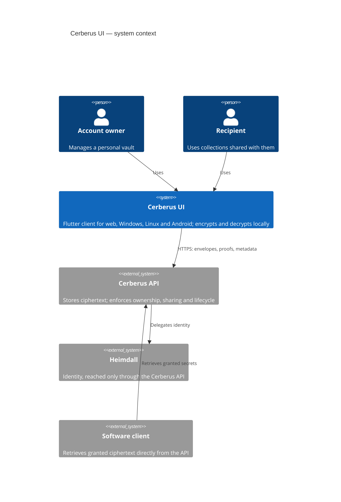
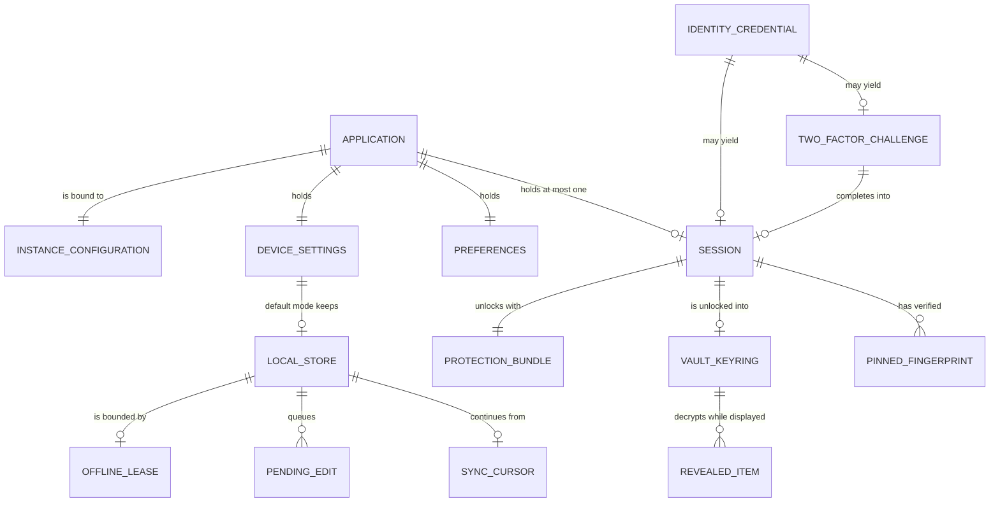
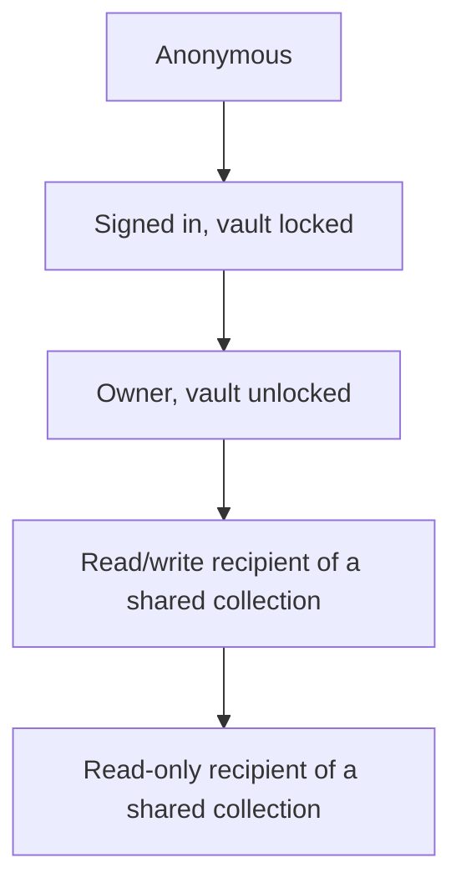

# Vision Document — Cerberus UI

## 1. Introduction

### 1.1 Purpose

This document states what **Cerberus UI** is for, who it serves, the features it delivers and the
constraints it works within. It is the starting point of the formal specifications: the
[System Requirements Document](System%20Requirements%20Document.md) refines each feature here into
testable requirements, and the [Use Case Specification Document](Use%20Case%20Specification%20Document.md)
turns them into flows.

It derives from the approved [Project Overview](../initial/Project%20Overview.md) and
[Business Rules](../initial/Business%20Rules.md). Technologies are named in the
[Technology Stack Document](Technology%20Stack%20Document.md) and not restated here.

### 1.2 Scope

Cerberus UI is the client of the Cerberus vault: one Flutter application for the web, Windows,
Linux and Android. It covers:

- instance configuration and the per-device storage mode;
- registration, sign-in, second-factor completion, session handling, and account and identity
  details;
- the client half of the Cerberus protocol — local encryption, decryption, key wrapping, access
  proofs and lease verification;
- vault protection, unlock, lock, recovery and recovery-key refresh;
- profiles and device restriction, records, folders and collections;
- collection sharing and software access grants;
- offline use and synchronization in the default mode;
- the trash, the account lifecycle and data export;
- presentation preferences and device hygiene.

It does **not** cover the vault's server-side domain — ownership, grant enforcement, retention,
backup reconciliation — which is the [Cerberus API](https://github.com/artur-rios/cerberus-api)'s.
It does not retrieve software secrets, which is an API surface for software clients, and it does
not administer an API instance.

### 1.3 Definitions and Acronyms

| Term | Definition |
| --- | --- |
| **Vault** | Everything an account owns in Cerberus: profiles, records, folders, collections and their keys. |
| **Envelope** | The protocol's encrypted container for content or keys. The only form in which vault content leaves memory. |
| **Unlock** | Deriving the open profile's keys from a password, on the device. Separate from signing in. |
| **Lock** | Discarding every key and every decrypted item from memory. |
| **Profile** | A view and access boundary inside an account, opened by itself on a device. |
| **Device profile** | A profile to which one device is restricted. |
| **Storage mode** | Per device: *default* (offline-capable, ciphertext kept on the device) or *online only* (nothing kept). The web is always online only. |
| **Local store** | The device's ciphertext copy of the vault in the default mode. |
| **Offline lease** | The API-signed authorization that bounds offline use. |
| **Fingerprint** | A short representation of a recipient's public key, compared through an independent channel before sharing. |
| **Recovery secret** | The one-time recovery key generated on the device and shown once. |
| **E2EE** | End-to-end encryption: only the owner's and authorized recipients' devices can decrypt. |
| **LGPD / GDPR** | The Brazilian and European data protection regulations the system complies with. |

---

## 2. Problem Statement

| The problem of | Affects | The impact of which is | A successful solution would |
| --- | --- | --- | --- |
| A vault whose server cannot read it still has to be opened somewhere | The account owner | Keys and plaintext leak through the client — storage, logs, clipboard, screenshots, a browser cache | Keep plaintext and usable keys in memory only, for as short a time as possible |
| Needing secrets where there is no network | The owner on desktop and Android | An online-only vault fails exactly when it is needed | Keep an encrypted copy on trusted devices, with offline access bounded by a renewable lease |
| Browsers and shared devices are not trustworthy storage | The owner on the web or a borrowed device | A cached vault outlives the session | Persist nothing on the web, and offer online-only mode elsewhere |
| Not every device should see everything | The owner with several devices | A lost phone exposes the whole vault | Restrict a device to one profile, which is all it opens and stores |
| Sharing and revocation are easy to misrepresent | Owners and recipients | Users believe a revocation retracted what was already copied | Verify recipients' keys before sharing, state plainly what revocation can and cannot do |

---

## 3. Product Position Statement

**For** people who want one protected home for their passwords, credentials, notes and secrets,
**who** need it on their desktop, phone and browser and sometimes without a network, **Cerberus
UI** is a single cross-platform vault client **that** encrypts and decrypts everything on the device
and keeps only ciphertext where it keeps anything at all. **Unlike** a client that trusts its server
or caches what it shows, Cerberus UI treats the server as unable to read the vault and the browser
as unable to keep it.

---

## 4. Stakeholders

| Stakeholder | Role | Interest |
| --- | --- | --- |
| **Account owner** | Primary user | A vault that is usable everywhere and readable only by them and the people they chose. |
| **Shared-collection recipient** | Secondary user | Exactly what was shared, with the permission granted. |
| **Project owner** | Sponsor, maintainer and first beta user | One process and one skeleton across the sibling repositories; a release validated by daily use. |
| **Cerberus API** | The system consumed | Clients that honor the contracts and the client obligations it cannot enforce itself. |
| **Protocol reviewers** | Security and interoperability review | An independent client implementation that produces and verifies the protocol's vectors. |

---

## 5. High-Level Architecture

Inside the application, features depend on repositories, repositories on the generated API client
and — in the default mode — the local store, and everything cryptographic goes through one
`core/crypto` module. The detail is in the
[System Requirements Document §2](System%20Requirements%20Document.md) and the
[Operations & Infrastructure Document §2](Operations%20%26%20Infrastructure%20Document.md).

---

## 6. Core Features

| ID | Feature | Description |
| --- | --- | --- |
| F-01 | Instance configuration and storage modes | Name the API instance; choose per device between the default offline-capable mode and online only; the web is always online only. |
| F-02 | Session and identity | Register, sign in, complete second-factor challenges, restore and end the session, and manage account and identity details. |
| F-03 | Client-side cryptography | The client half of the reviewed Cerberus protocol: envelopes, metadata verification, key derivation, wrapping, proofs and lease verification. |
| F-04 | Vault protection and recovery | Master or per-profile passwords, unlock and lock, protection changes, one-time recovery and recovery-key refresh. |
| F-05 | Profiles and devices | Manage profiles and their contents, and restrict a device to one profile. |
| F-06 | Records | Named records of typed fields, from scratch or from a template; open, reveal, copy, edit, move and delete them. |
| F-07 | Folders | Nested folders: create, rename, move without cycles and delete with their contents. |
| F-08 | Collections | Group records and folders in collections that profiles can include. |
| F-09 | Collection sharing | Share collections read-only or read/write after verifying the recipient's key; change and revoke shares; use what is shared with you. |
| F-10 | Software access | Grant software identities read access to selected records or collections, and revoke it. |
| F-11 | Offline use and synchronization | The local ciphertext store, the offline policy and lease, offline edits, and synchronization with latest-edit-wins. |
| F-12 | Trash | List, restore and empty the trash within the 30-day window. |
| F-13 | Account lifecycle and data rights | Close the account, cancel closure, delete it immediately and export its data. |
| F-14 | Presentation and preferences | Theme, auto-lock timeout, clipboard clearing interval and consistent view states. |
| F-15 | Privacy and device hygiene | No telemetry, no sensitive logs, screen-capture protection and a single outbound destination. |

All fifteen features are in the first release.

---

## 7. Domain Model Overview

The client's own model. The vault entities it displays — records, folders, collections, profiles,
grants — are the API's and are modeled in the API's System Requirements Document.

---

## 8. Roles Hierarchy

The application has no administrative role. Its actors differ in what they may do with a given
piece of content, and in how far into the application they have come.

Each step down holds fewer rights over a given collection: the owner manages it, a read/write
recipient edits its content, a read-only recipient reads it. Signed-in-but-locked sees no vault
content at all; anonymous sees only configuration and identity entry.

---

## 9. Constraints

| Constraint | Source |
| --- | --- |
| One Flutter code base for the web, Windows, Linux and Android; no iOS or macOS. | Brainstorm |
| Latest stable Flutter, Dart and libraries, recorded in one document. | Brainstorm; [Technology Stack Document](Technology%20Stack%20Document.md) |
| Built the same way as the Heimdall and Fortuna UIs. | Brainstorm |
| The only service called is the Cerberus API; identity is Heimdall's, reached through it. | Brainstorm; API BR-02 |
| Plaintext and usable keys never leave the device. | API BR-10 |
| Only the reviewed Cerberus protocol; dependent flows blocked until its review passes. | API NFR-11 and IR-09 |
| The web persists nothing in the browser; online-only devices persist no vault data. | Brainstorm; API BR-19 |
| Offline access bounded by a renewable lease, 24 hours by default; revocations enforced on reconnection. | API BR-16 and BR-17 |
| Latest-edit-wins conflict resolution, as the API decides it. | API BR-18 |
| LGPD and GDPR compliance in the obligations that fall to a client. | Brainstorm; API BR-29 |
| No numerical performance targets for the beta; measured, not invented. | API System Requirements §6 |

---

## 10. Success Criteria

| Criterion | Measure |
| --- | --- |
| Plaintext stays on the device | Tests that record every request body and every local-store write find no plaintext and no unwrapped key, for every content-bearing flow. |
| Unlock is separate from sign-in | A signed-in, locked session renders no vault content. |
| Offline works where it should | The default mode opens, reads and edits the vault with no network, and locks it on lease expiry. |
| Nothing persists where it must not | Online-only devices and the web leave no vault data, token or cache behind. |
| Revocation first | A reconnected device removes revoked content before displaying new content. |
| Bounded sharing | A recipient sees only the shared collection; read-only recipients are offered no edits. |
| One-time recovery | Recovery succeeds once; the new secret is shown once; the old one is refused. |
| Protocol fidelity | The client passes the RFC and Cerberus interoperability vectors. |
| Coverage | Every use case's main flow and alternative flows have tests that name them. |
| Beta | The project owner uses the release daily on all four platforms. |
